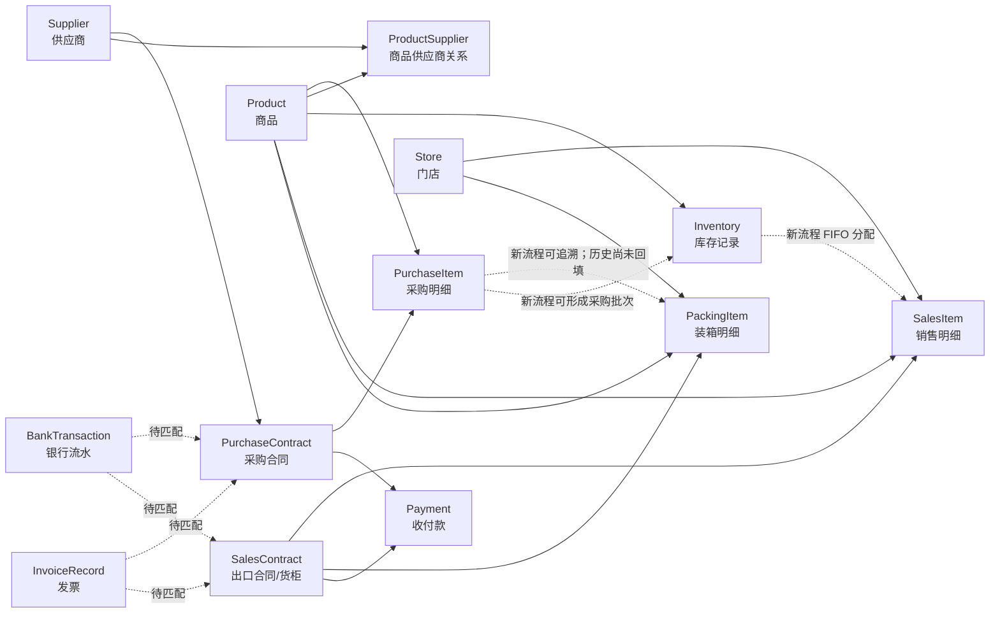

# 进销存核心数据 Schema 与迁移蓝图

> 版本：v1.0
> 数据快照：2026-07-31，本机 `backend/prisma/dev.db`（只读检查）
> 结构事实来源：`backend/prisma/schema.prisma`
> 用途：理解现有数据链路、准备快速迁移、识别待补数据
> 数据范围：只记录结构、数量和完整率，不记录供应商账户、联系人或财务明细值

## 1. 先说结论

当前库是 **SQLite + Prisma**，已经具备供应商、商品、采购、出口销售、装箱、库存、收付款和财务原始资料等核心表。现有数据可以稳定回答：

- 某个商品历史上向哪些供应商采购过；
- 某个供应商有哪些采购合同和采购商品；
- 某个出口合同装了哪些商品、发往哪些门店；
- 当前系统记录了哪些库存状态、付款、银行流水和发票。

当前还不能对全部历史数据稳定回答：

- 某一条销售/装箱记录究竟消耗了哪一批采购库存；
- 某一批库存当前位于哪个仓库/库位；
- 任意时点的库存增减流水和可审计结存；
- 一个门店属于哪个客户主体；
- 银行流水、发票与采购/销售合同之间的已复核关联。

最关键的迁移原则是：**先迁主数据，再迁单据，再迁批次和库存流水；不能唯一关联的历史行进入待裁决表，不按名称或金额强行猜测。**

## 2. 当前核心数据链路



实线表示当前明确的外键关系；虚线表示字段或新流程已经支持，但历史数据覆盖不足或仍需匹配。

## 3. 当前重要表结构

### 3.1 主数据层

| 表 | 一行代表什么 | 主键 | 当前业务键/约束 | 关键关系 | 实存行数 |
|---|---|---|---|---|---:|
| `ports` | 一个目的港 | `id` | `name`、`code` 均唯一 | 1:N 门店、出口合同 | 3 |
| `stores` | 一个海外门店/收货点 | `id` | `name` 唯一 | N:1 港口；1:N 销售/装箱明细 | 21 |
| `suppliers` | 一个供应商主体 | `id` | **名称目前不唯一**；税号也未设唯一 | 1:N 采购合同；N:M 商品 | 95 |
| `product_categories` | 一个商品分类 | `id` | `name` 唯一 | 自关联父子；1:N 商品 | 14 |
| `products` | 一个商品主数据 | `id` | 当前无 SKU；仅有报关名等候选字段 | N:M 供应商；关联采购/销售/库存 | 201 |
| `product_suppliers` | 一组商品—供应商关系 | `id` | `(productId, supplierId)` 唯一 | N:1 商品、N:1 供应商 | 156 |

核心字段：

- `suppliers`：`name`、`shortName`、联系人、地址、税号、银行信息、质量标记、启用状态。
- `products`：`customsName`、描述、规格、单位、分类、HS 编码、申报要素、重量/体积/包装/尺寸、启用状态。
- `product_suppliers`：`productId`、`supplierId`、参考采购价。

迁移注意：`Supplier.name` 和 `Product.customsName` 目前只是候选匹配键，不是可靠的跨系统稳定编码。目标库应补 `supplierCode` 和 `sku`。

### 3.2 采购层

| 表 | 一行代表什么 | 主键 | 业务键/约束 | 关键关系 | 实存行数 |
|---|---|---|---|---|---:|
| `purchase_contracts` | 一份采购合同 | `id` | `contractNo` 唯一 | N:1 供应商；1:N 明细/付款 | 194 |
| `purchase_items` | 合同中的一个商品行 | `id` | 当前无行号唯一约束 | N:1 合同、N:1 商品 | 278 |

主要字段：

- 合同：供应商、总额/已付、税率、状态、签订/预计/生产完成日期、发票号、发货门店文本、备注。
- 明细：商品、数量、单位、单价、总价、规格、箱数、重量、体积、单箱尺寸、备注。

建议迁移自然键：`contractNo`；明细建议使用 `(contractNo, sourceLineNo)`，不能用商品名代替行号，因为同一合同可能出现同商品的不同规格或批次。

### 3.3 销售、货柜与装箱层

| 表 | 一行代表什么 | 主键 | 业务键/约束 | 关键关系 | 实存行数 |
|---|---|---|---|---|---:|
| `sales_contracts` | 一份出口合同，同时代表一个货柜业务单 | `id` | `contractNo` 唯一 | N:1 港口；1:N 销售/装箱/收款 | 47 |
| `sales_items` | 出口合同中的一个商品—门店行 | `id` | 当前无行号唯一约束 | N:1 合同、商品、门店 | 439 |
| `packing_items` | 某货柜实际装入的一种商品来源行 | `id` | 当前无组合唯一约束 | N:1 合同/商品；可选采购明细/门店 | 449 |

`packing_items.purchaseItemId` 是回答“这批货来自哪个供应商”的关键外键：

```text
packing_items.purchaseItemId
  -> purchase_items.purchaseContractId
  -> purchase_contracts.supplierId
  -> suppliers.id
```

新流程已经会在“从已完工采购明细导入货柜”时写入该字段；历史装箱数据尚未回填，所以迁移时必须把“有确定采购来源”和“只有厂家文本”分开处理。

### 3.4 库存与收付款层

| 表 | 一行代表什么 | 主键 | 当前约束 | 关键关系 | 实存行数 |
|---|---|---|---|---|---:|
| `inventories` | 一条处于生产/入库/出库状态的商品数量记录 | `id` | 无批次号、仓库和流水唯一键 | 商品必填；采购/销售来源可选 | 302 |
| `payments` | 一笔收款、付款或分配记录 | `id` | `idempotencyKey` 可选唯一 | 可选采购合同/销售合同/来源付款 | 90 |
| `bank_transactions` | 一条银行原始流水 | `id` | 批次内未定义稳定唯一键 | N:1 导入批次；合同为弱关联字段 | 811 |
| `invoice_records` | 一条发票级记录 | `id` | 当前未定义发票组合唯一键 | N:1 导入批次；合同为弱关联字段 | 1,476 |

当前 `inventories` 的 Implementation 可支持新业务：采购入库建立带 `purchaseItemId` 的记录，销售出库按 FIFO 分配并带上 `salesItemId`。但现存 302 条均为旧导入记录，没有采购明细或销售明细来源，因此它们只能作为历史状态快照，不能作为完整库存台账。

## 4. “哪些货是哪些供应商的”现在怎么查

### 4.1 历史供货关系（当前可靠）

```sql
SELECT
  p.id AS product_id,
  p.customsName AS product_name,
  s.id AS supplier_id,
  s.name AS supplier_name,
  COUNT(DISTINCT pc.id) AS purchase_contract_count
FROM purchase_items pi
JOIN purchase_contracts pc ON pc.id = pi.purchaseContractId
JOIN products p ON p.id = pi.productId
JOIN suppliers s ON s.id = pc.supplierId
GROUP BY p.id, p.customsName, s.id, s.name;
```

当前库的历史采购共形成 156 组商品—供应商组合，和 `product_suppliers` 的 156 组完全一致；120 个商品只有一个历史供应商，15 个商品存在多个历史供应商，66 个商品既无采购历史也无商品—供应商映射。

### 4.2 某次装箱的实际来源（仅新数据可靠）

```sql
SELECT
  pki.id AS packing_item_id,
  sc.contractNo AS sales_contract_no,
  p.customsName AS product_name,
  pc.contractNo AS purchase_contract_no,
  s.name AS supplier_name
FROM packing_items pki
JOIN sales_contracts sc ON sc.id = pki.salesContractId
JOIN products p ON p.id = pki.productId
LEFT JOIN purchase_items pi ON pi.id = pki.purchaseItemId
LEFT JOIN purchase_contracts pc ON pc.id = pi.purchaseContractId
LEFT JOIN suppliers s ON s.id = pc.supplierId;
```

历史 449 条装箱记录的 `purchaseItemId` 当前均为空，所以不得把 `manufacturer` 文本自动当成已经确认的供应商主数据。应优先按采购合同号定位供应商；无合同号时再用正式名称和唯一税号生成候选，由业务人员确认。

当前库虽然保留空的 `supplier_aliases` 历史表，但它不属于目标迁移必需数据，也不再要求维护独立别名目录。合同名称与系统正式名称不一致时，保留来源差异和裁决记录即可。

## 5. 目标 Schema：最小增量设计

现有采购和销售单据表可以保留。为了形成可审计的进销存闭环，建议增量补以下 Module，而不是推倒重建。

### 5.1 主数据稳定编码

| 现有表 | 建议新增字段 | 约束 | 目的 |
|---|---|---|---|
| `suppliers` | `supplierCode` | 非空、唯一 | 跨系统稳定供应商编码 |
| `products` | `sku` | 非空、唯一 | 区分同报关名不同规格商品 |
| `stores` | `storeCode`、`customerId` | 编码唯一 | 把客户主体与收货门店分开 |
| `purchase_items` | `lineNo` | `(purchaseContractId, lineNo)` 唯一 | 稳定定位合同明细 |
| `sales_items` | `lineNo` | `(salesContractId, lineNo)` 唯一 | 稳定定位销售明细 |

税号建议在解决当前重复候选后再建立“非空值唯一”规则；不能为了加约束而删除或合并现有记录。

### 5.2 客户、仓库、批次和库存流水

```prisma
model Customer {
  id           String  @id @default(cuid())
  customerCode String  @unique
  name         String
  isActive     Boolean @default(true)
  // Store.customerId -> Customer.id
}

model Warehouse {
  id            String  @id @default(cuid())
  warehouseCode String  @unique
  name          String
  isActive      Boolean @default(true)
}

model InventoryLot {
  id             String   @id @default(cuid())
  lotNo          String   @unique
  productId      String
  purchaseItemId String?
  warehouseId    String
  receivedAt     DateTime?
  unitCost       Decimal?
  sourceType     String   // PURCHASE | OPENING | ADJUSTMENT
  sourceRef       String?
}

model InventoryMovement {
  id             String   @id @default(cuid())
  idempotencyKey String   @unique
  lotId          String
  movementType   String   // RECEIPT | SHIPMENT | TRANSFER_IN | TRANSFER_OUT | ADJUSTMENT
  quantityDelta  Decimal  // 入库为正，出库为负
  occurredAt     DateTime
  documentType   String?
  documentId     String?
  documentLineId String?
}

model SalesAllocation {
  id            String  @id @default(cuid())
  salesItemId   String
  packingItemId String?
  lotId         String
  quantity      Decimal

  @@unique([salesItemId, packingItemId, lotId])
}
```

上面是目标结构说明，不应直接对真实 SQLite 执行。正式落地必须先备份，再通过 `npm run db:migrate` 生成并审核 Prisma migration；禁止对真实库运行 `prisma db push`。

目标链路为：

```text
供应商 -> 采购合同 -> 采购明细 -> 库存批次 -> 库存流水
                                      |
                                      +-> 销售分配 -> 销售明细/装箱明细 -> 出口合同
```

这样“哪些货属于哪些供应商”有三种清晰口径：

1. 可供货关系：`product_suppliers`；
2. 实际采购关系：`purchase_items -> purchase_contracts -> suppliers`；
3. 实际销售批次来源：`sales_allocations -> inventory_lots -> purchase_items -> suppliers`。

## 6. 快速迁移的文件模板与导入顺序

### 6.1 建议准备的迁移文件

| 文件 | 一行粒度 | 必填键 | 重要推荐字段 |
|---|---|---|---|
| `supplier_master.csv` | 一个供应商主体 | `supplier_code`, `name` | `tax_id`, `short_name`, `address`, `contact_*`, `bank_*`, `active` |
| `product_master.csv` | 一个 SKU | `sku`, `customs_name` | `specification`, `unit`, `category`, `hs_code`, 包装/重量/尺寸 |
| `product_supplier.csv` | 一个 SKU—供应商组合 | `sku`, `supplier_code` | `reference_price`, `effective_from` |
| `purchase_contract.csv` | 一份采购合同 | `contract_no`, `supplier_code` | 状态、日期、税率、金额 |
| `purchase_item.csv` | 一条采购明细 | `contract_no`, `line_no`, `sku` | 数量、单位、单价、箱数、重量/体积 |
| `customer_store.csv` | 一个门店 | `customer_code`, `store_code`, `store_name` | 港口、地址、启用状态 |
| `sales_contract.csv` | 一份出口合同/货柜 | `contract_no` | 港口、状态、发运日期、柜号 |
| `sales_item.csv` | 一条销售明细 | `contract_no`, `line_no`, `sku`, `store_code` | 数量、售价 |
| `inventory_opening.csv` | 一个期初批次 | `lot_no`, `sku`, `warehouse_code` | 采购合同/行号、数量、单位成本、入库日 |
| `packing_allocation.csv` | 一条装箱批次分配 | `sales_contract_no`, `sales_line_no`, `lot_no` | 数量、箱数 |

银行账号、联系人等属于 Confidential 数据，只能进入受控迁移文件和权限受限的目标字段，不能复制到普通文档、日志或错误报告。

### 6.2 导入顺序

1. 建立迁移批次、源系统标识和源键映射；
2. 导入港口、客户、门店、仓库、分类等字典；
3. 导入供应商主体；合同名称差异进入裁决清单，不另建别名目录；
4. 导入商品，再导入商品—供应商关系；
5. 导入采购合同和采购明细；
6. 导入库存期初批次和库存流水；
7. 导入出口合同、销售明细、装箱明细；
8. 导入销售批次分配，打通销售到采购来源；
9. 导入付款、银行流水、发票，再做合同匹配；
10. 做数量、金额、外键和业务状态验收后切换读取。

### 6.3 幂等和待裁决

建议迁移程序至少维护：

- `migration_runs`：一次迁移批次、源系统、开始/完成时间、状态、计数；
- `migration_crosswalks`：`source_system + entity_type + source_key -> target_id`，组合唯一；
- `migration_rejects`：源文件、Sheet/行号、实体类型、错误码、脱敏后的说明、处理状态；不保存整行敏感原文。

任何重复执行都先查 crosswalk 或目标自然键；存在冲突时进入 rejects，不覆盖已有事实。

## 7. 当前数据缺口与优先级

| 优先级 | 缺口 | 当前证据 | 影响 | 建议动作 |
|---|---|---|---|---|
| P0 | 历史装箱未绑定采购明细 | 449/449 未填 `purchaseItemId` | 无法追溯实际供货批次 | 用采购合同号、商品、数量/箱数和日期生成候选；人工确认后回填 |
| P0 | 历史库存无采购/销售来源 | 302/302 均无 `purchaseItemId`、`salesItemId` | 无法审计库存成本与出库来源 | 作为“历史快照”单独迁移；有正式证据才转换成批次 |
| P0 | 缺仓库、库位、批次和库存流水 | 当前 Schema 无对应表 | 无法做准确进销存结存 | 落地 Warehouse、InventoryLot、InventoryMovement |
| P0 | 主数据无稳定编码 | 供应商无 code，商品无 SKU | 跨系统迁移易误合并 | 生成并冻结编码；名称只用于候选匹配 |
| P1 | 供应商关键资料不完整 | 税号缺 19、地址缺 16、银行账号缺 17、完全无联系方式 1 | 合同、付款和去重受影响 | 从正式合同/发票补齐并记录来源 |
| P1 | 商品资料不完整 | 规格缺 90、单位缺 29、HS 缺 133、分类缺 2 | 采购、装箱、报关分析受限 | 优先补活跃商品和出口商品 |
| P1 | 66 个商品无供应商关系 | 66/201 无映射且无采购历史 | 无法给采购建议 | 查正式采购/装箱证据；无法确认则保留未知 |
| P1 | 客户主体未独立建模 | 只有门店，销售合同无 customerId | 客户级应收和毛利口径不稳 | 新建 Customer，门店作为收货点 |
| P1 | 财务资料尚未匹配合同 | 811 流水、1,476 发票均未标记 MATCHED；90 笔付款中 31 笔未连合同 | 付款/发票闭环不足 | 按对方、号码、日期、金额生成候选并人工复核 |
| P2 | 候选税号重复 | 发现 1 组非空税号重复 | 可能是重复主体或共享/误录 | 先人工核验，不自动合并 |
| P2 | 空合同 | 3 份采购合同、1 份销售合同无明细 | 迁移后形成空业务单 | 确认是草稿、占号还是缺行 |

## 8. 迁移验收清单

迁移完成必须同时满足：

- SQLite/目标数据库完整性检查通过，外键异常为 0；
- 主数据编码唯一，供应商税号重复候选已人工裁决；
- 采购合同数、采购明细数、销售合同数、销售明细数按迁移范围核对一致；
- 每条采购/销售明细均可回到主数据，不以自由文本代替外键；
- 库存满足 `期初 + 入库 - 出库 ± 调整 = 期末`，按 SKU、仓库、批次都可复算；
- 每条销售批次分配可追到库存批次；采购来源未知的历史数据明确标为 `OPENING/UNKNOWN`，不能伪造供应商；
- 付款、银行流水、发票的“未匹配/候选/已确认”状态分开；
- 重跑同一迁移批次不新增重复记录；
- rejects 数量、原因和裁决状态可审计；
- 抽样复核至少覆盖：单供应商商品、多供应商商品、拆批装柜、跨门店出口、部分付款和历史未知库存。

可直接运行配套的只读检查脚本：[进销存迁移只读质量检查.sql](./进销存迁移只读质量检查.sql)。

## 9. 实施建议

推荐分两期：

- 第一期先完成供应商编码、商品 SKU、商品—供应商关系和合同名称差异裁决清单，快速获得可靠的采购分析；
- 第二期新增仓库/批次/流水/销售分配，从一个全新的真实采购—销售业务单开始跑通，再决定历史数据回填范围。

这样不会阻塞当前系统使用，也不会为了追求“历史全连通”而制造错误事实。
