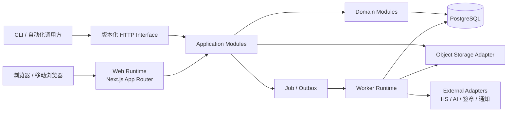
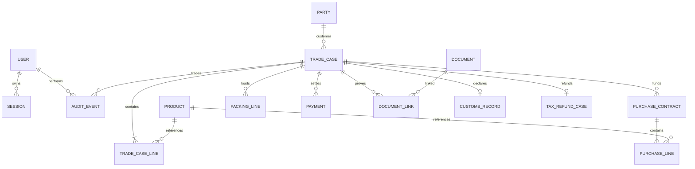
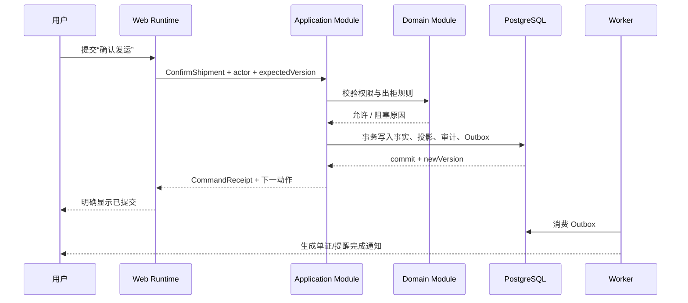
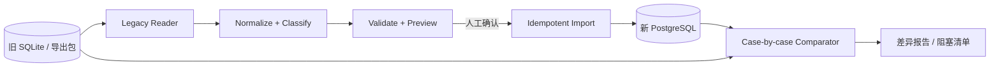

# 捷淞业务执行系统：绿地重建技术架构方案

> 文档状态：V0.1，建议方案
>
> 基线日期：2026-07-31
>
> 产品范围见 [PRD.md](./PRD.md)。

## 1. 架构结论

建议采用 **TypeScript 模块化单体 + PostgreSQL + 对象存储 + 独立 Worker**，不再维护浏览器前端、Express 后端和大量历史脚本三套演进节奏，也不拆微服务。



这个方案保留一个代码库、一个业务模型和一套校验规则，但把耗时任务从 Web Runtime 分离。部署面只有四项：Web、Worker、PostgreSQL、对象存储。

## 2. 架构原则

1. **专项单是业务根**：采购、装箱、单证、发票和结清都从专项单进入，不再各自形成平行主流程。
2. **Interface 与实现同仓同语言**：浏览器表单、版本化 HTTP Interface、任务队列共享同一组命令、查询和 Zod Schema。
3. **状态由事实推导**：阶段状态和下一动作由纯函数 Workflow Module 计算；不允许多处分散维护同一状态含义。
4. **写入命令化**：每次业务写入都是具名命令，具备权限、校验、事务、审计和幂等语义。
5. **文件是证据，不是字段垃圾桶**：原件进入受限对象存储；数据库保存元数据、哈希、分类、关联和结构化结论。
6. **外部能力必须可降级**：AI、HS 在线源、签章和通知失败时，核心事实仍可保存，并明确进入待处理状态。
7. **先做深 Module，再设 Seam**：只有存在两个真实 Adapter 或明确替换需求时才暴露 Seam。
8. **迁移是产品能力**：导入预览、来源键、差异报告和回滚从第一天存在，不以一次性脚本收尾。

## 3. 技术选型

| 领域 | 选择 | 原因 |
|---|---|---|
| 语言 | TypeScript，全栈严格模式 | 消除当前 JavaScript/TypeScript 两套业务类型与错误语义 |
| Web | Next.js 16 App Router + React 19 | 沿用现有团队经验；页面、服务器渲染和 HTTP Adapter 同仓 |
| UI | Tailwind CSS + shadcn/ui | 满足仓库强制设计规范，减少自建控件 |
| 校验 | Zod | 同一 Schema 用于表单、命令和外部 Interface |
| 数据库 | PostgreSQL 16 | 单一生产级数据库，支持事务、约束、JSONB、全文检索和并发控制 |
| 数据访问 | Prisma，固定单一 PostgreSQL Provider | 团队已有经验；绿地版禁止 SQLite/PostgreSQL 双语义漂移 |
| 会话 | 数据库会话 + HttpOnly/Secure/SameSite Cookie | 可撤销、可审计；避免长效 JWT 难以失效 |
| 密码 | Argon2id | 使用成熟密码哈希，不自行实现认证算法 |
| 文件 | S3 兼容对象存储；本地开发用 MinIO | 将受限文件移出应用磁盘，便于权限、备份和生命周期管理 |
| 后台任务 | PostgreSQL 持久化任务/Outbox + Worker | 不引入 Redis；支持重试、幂等和断点恢复 |
| 测试 | Vitest + PostgreSQL 集成测试 + Playwright | 覆盖规则、事务、权限与真实用户流程 |
| 可观测性 | Pino 结构化日志 + OpenTelemetry/Sentry | 分离日志、错误和性能证据，禁止记录敏感正文 |

### 3.1 为什么不选微服务

- 当前业务团队和调用规模不需要独立扩缩容。
- 八阶段需要强事务与跨阶段一致性，拆分会增加分布式失败模式。
- 现有问题是 Interface 和入口过多，不是单体吞吐不足。
- Worker 已隔离 PDF、Excel、AI 和定时任务等资源波动，无需进一步拆分。

### 3.2 为什么不继续前后端完全分离

- 当前系统在浏览器类型、后端校验、路由和错误之间存在重复维护。
- 内部业务页面没有必须独立发布的原生客户端。
- 外部自动化仍可通过版本化 HTTP Adapter 调用，不影响未来接入。

## 4. Module 划分

### 4.1 外部可见 Module

| Module | Interface 职责 | 主要实现 |
|---|---|---|
| Identity | 登录、登出、会话、角色与权限判断 | 用户、会话、角色策略 |
| Trade Case | 创建专项单、执行八阶段命令、查询下一动作 | 专项单、采购、生产、装箱、单证、发票、退税规则 |
| Finance | 收付登记、汇率快照、毛利、结清、账期导入 | 分币种账目、匹配、财务投影视图 |
| Master Data | 往来方、商品、港口、HS 资料 | 主数据及来源/有效期 |
| Evidence | 上传、分类、校验、下载、保留和来源追溯 | 对象存储、哈希、文件权限、解析结果 |
| Migration | 预览、差异、幂等导入、回放 | 旧系统 Reader Adapter、来源键、导入批次 |
| Audit & Notification | 操作审计、站内提醒、后台任务状态 | 追加审计、Outbox、通知投影 |

AI 不成为业务 Module。它是 Trade Case、Master Data 和 Finance 内部使用的 Adapter；所有建议先返回候选和证据，再由用户确认。

### 4.2 Trade Case Module 的深 Interface

调用方只需要学习少量业务命令，而不是自行拼接状态：

```ts
type TradeCaseCommand =
  | CreateTradeCase
  | LinkPurchaseContract
  | RecordPurchasePayment
  | CompleteProduction
  | UpdatePackingPlan
  | ConfirmShipment
  | RecordDocumentCheck
  | RecordSupplierInvoice
  | AdvanceTaxRefund
  | RecordReceipt
  | CloseTradeCase;

executeTradeCaseCommand(command, actor): Promise<CommandReceipt>;
getTradeCaseWorkspace(id, actor): Promise<TradeCaseWorkspace>;
```

`CommandReceipt` 必须包含：是否提交、专项单版本、阶段变化、下一动作、审计编号和后台任务编号。失败时明确 `committed: false`。

### 4.3 内部 Seam

- `DocumentStore`：MinIO / 生产对象存储两个 Adapter。
- `HsEvidenceSource`：本地税则快照 / HSCIQ 两个 Adapter。
- `AiAssistant`：禁用 Adapter / OpenAI-compatible Adapter。
- `NotificationChannel`：站内通知 / 未来邮件或 IM Adapter。
- `LegacyReader`：当前 SQLite Reader / 导出包 Reader。

电子签章首版只有人工跳转，不为假设中的第二个 Adapter 提前设计复杂 Seam。

## 5. 代码组织

```text
apps/
  web/                         # Next.js 页面、Server Actions、Route Handlers
  worker/                      # 导入、解析、文档生成、提醒、AI 任务
packages/
  domain/
    identity/
    trade-case/
    finance/
    master-data/
    evidence/
    audit/
  application/                 # 命令、查询、事务编排、权限策略
  contracts/                   # Zod Schema、错误码、外部 Interface 类型
  infrastructure/
    postgres/
    object-storage/
    external-adapters/
  ui/                          # shadcn/ui 与产品级复用 UI
prisma/
  schema.prisma
  migrations/
scripts/
  migration/                   # 只保留受测、可重复的正式迁移工具
docs/
  adr/
  runbooks/
```

限制：页面不得直接访问 Prisma；基础设施实现不得向上泄露数据库行结构；旧系统脚本不得复制到新主干。

## 6. 数据架构

### 6.1 逻辑模型



### 6.2 建模规则

- `trade_case` 保存稳定身份、负责人、目的地、计划/实际发运日和乐观锁版本，不保存八个重复布尔状态。
- 阶段进度由 Workflow Module 从采购、付款、生产、装箱、单证、发票、退税和收款事实推导。
- 为列表性能可保存 `workflow_projection`，但它是可重建投影；每次业务事务后同步刷新，并由校验任务检查漂移。
- 金额统一使用 `numeric` 和明确币种，不使用浮点；汇率保存值、日期和来源。
- 业务状态使用数据库约束或枚举；状态变更只经过对应命令。
- 附件实体只保存对象键、SHA-256、大小、MIME、分类、敏感级别和保留策略；不保存公开 URL。
- 导入记录保存 `source_system + source_key + source_hash`，保证重复运行不新增重复事实。
- 审计为追加写；不采用完整 Event Sourcing，避免把查询和迁移复杂度扩大到所有 Module。

### 6.3 事务与并发

- 每个命令在一个 PostgreSQL 事务内完成事实写入、版本递增、工作流投影、审计和 Outbox。
- 更新专项单时携带 `expectedVersion`；版本冲突返回可重试错误，不静默覆盖。
- 文件先进入隔离区，校验通过后才在事务中建立业务关联；权限收紧失败则不持久化。
- 导入先完整解析和校验，再整批提交；大批量按可恢复分片写入，但每个来源文件保持原子性。

## 7. 关键执行流

### 7.1 普通业务命令



### 7.2 文件与长任务

1. Web 请求上传会话，服务器返回短时签名上传地址。
2. 浏览器直传隔离 Bucket，文件默认不可公开访问。
3. Worker 校验文件头、大小、哈希、恶意内容和业务格式。
4. 校验成功后写入 `document` 并关联专项单；失败文件进入隔离过期队列。
5. PDF/Excel 解析只保存结构化输出和必要证据位置，不把完整正文写入日志。
6. 页面轮询或 SSE 接收任务状态；任务回执和业务提交回执分开。

## 8. 权限与安全

- 默认拒绝；所有命令和查询都通过集中策略检查，页面隐藏不能代替权限。
- 财务行级资料仅管理员和财务可读取；业务经办只看专项单需要的汇总状态。
- 受限附件使用短时下载地址；对象存储与数据库均加密备份。
- 密钥只通过环境或密钥管理注入；任何 Interface 只返回 `configured` 或掩码后缀。
- 日志只保留路由模板、字段结构/数量、状态和耗时；不记录请求正文、查询值、AI 提示、工具定义、密钥或财务明细。
- 关键动作需要近期会话；高风险动作可增加二次确认，但不把浏览器确认框当作授权。
- 数据分类沿用 Restricted / Confidential / Internal / Public，并在表、字段和文件类别上显式标记。

## 9. 外部 Adapter 与降级

| Adapter | 正常模式 | 降级模式 | 禁止行为 |
|---|---|---|---|
| HS 在线源 | 拉取归类实例、详情和申报要素 | 使用带版本日期的本地快照 | 把 AI 推断显示为官方来源 |
| AI | 生成候选、解释差异、解析非结构化输入 | 关闭并保留人工录入 | 自动确认付款、HS、报关、退税、结清 |
| 电子签章 | 跳转已配置平台并等待人工归档 | 下载待签文件，稍后上传盖章件 | 仅因打开外部页面就标记已签 |
| 通知 | 站内通知和后台任务状态 | 工作台待办继续可见 | 通知失败阻断核心事实保存 |
| 汇率 | 使用已配置权威来源并保存快照 | 人工录入并标记来源 | 用最新汇率改写历史专项单 |

## 10. 可观测性与运行

### 10.1 部署拓扑

- `web`：1 个可水平扩展进程，无本地持久状态。
- `worker`：1 个起步，可按任务类型扩展。
- `postgres`：托管 PostgreSQL，启用每日备份和时间点恢复。
- `object storage`：版本控制、生命周期和访问日志。

不把 SQLite 带入生产；不依赖服务器本机附件目录；不要求 Redis。

### 10.2 健康检查与性能预算

- `/health/live`：进程存活，不探测外部依赖。
- `/health/ready`：数据库、迁移版本和对象存储可用。
- Worker 健康：最近心跳、队列年龄、失败/重试数量。
- 业务健康：无下一动作专项单数、投影漂移数、未匹配导入数、受限附件权限异常数。
- 普通查询 P95 < 300ms；普通写入 P95 < 800ms。
- 工作台首屏只取卡片投影，不联表即时重算全部历史事实。
- PDF/Excel/AI 进入后台任务；Web 请求在 300ms 内返回任务回执。
- Excel、Three.js、图表和 PDF 解析器只在使用时加载。

## 11. 测试策略

| 层级 | 重点 | 门禁 |
|---|---|---|
| Domain Module | 八阶段、80%/超限、币种、状态迁移、下一动作 | 所有规则分支全覆盖，纯函数快速测试 |
| Application Module | 权限、事务、幂等、版本冲突、审计/Outbox | PostgreSQL 集成测试 |
| Adapter | 对象存储、HS、AI、旧库读取 | 契约测试；失败和超时必须覆盖 |
| HTTP Interface | Schema、错误码、会话、限流 | 版本化 Interface 测试 |
| 浏览器 | 创建专项单、阻塞修复、发运、结清、导入预览 | Playwright 核心旅程 |
| 迁移 | 行数、金额、阶段、附件、来源键 | 新旧系统逐专项单差异为 0 或有批准解释 |
| 安全 | 越权、路径穿越、恶意上传、日志泄露、密钥回显 | 发布前强制通过 |

## 12. 迁移架构



### 12.1 迁移规则

- 旧库和原始工作簿只读；迁移程序不回写旧系统。
- 先迁主数据，再迁专项单事实、财务事实、附件元数据，最后重建工作流投影。
- 证据不足的数据进入 `needs_review`，不得为了通过迁移而编造门店、HS、金额、海关编号或完成状态。
- 原始工作簿不复制到普通附件区；敏感财务行在进入新库前脱敏。
- 旧路径、旧状态和旧编号映射集中在 `Legacy Reader`，不进入新 Domain Module。
- 每个批次可重复执行，结果由来源键和哈希决定；迁移前后均生成计数与校验和。

### 12.2 切换门禁

- 全新数据库可从零执行全部 migration。
- 选定历史范围的专项单、明细、金额、附件计数和阶段差异全部闭合。
- 影子运行连续 14 天无 P0/P1 差异。
- 备份恢复演练通过；回滚窗口、负责人和操作手册明确。
- 新系统成为唯一写入口后，旧系统立即切只读，禁止双写。

## 13. 分阶段实施

| 阶段 | 目标 | 交付 | 完成门禁 |
|---|---|---|---|
| G0 领域基线 | 固化规则和迁移口径 | 数据字典、状态机、旧库 Reader、差异基线 | 关键规则有来源和测试样例 |
| G1 骨架 | 建立可部署最小系统 | 身份、专项单、工作台、审计、PostgreSQL、对象存储 | 构建/迁移/权限/部署全绿 |
| G2 执行主线 | 打通前四阶段 | 采购签约、付款、生产、排柜出货 | 正常与阻塞旅程通过 |
| G3 单证与结清 | 打通后四阶段 | HS/三表/PDF 核对、发票、退税、财务 | 三笔专项单端到端通过 |
| G4 迁移与切换 | 新系统接管真实业务 | 全量只读迁移、影子比对、回滚演练 | 14 天无 P0/P1 差异 |
| G5 收尾 | 降低长期维护成本 | 旧系统只读归档、脚本清理、运行手册 | 无双写、无未归属数据 |

## 14. 关键取舍

| 决策 | 收益 | 代价 / 限制 |
|---|---|---|
| 模块化单体 | 小 Interface、强事务、部署简单 | 需要严格守住 Module 依赖，避免重新长成“大泥球” |
| Next.js 全栈 | 类型和校验集中、减少重复 | Worker 仍需独立进程；不能把重任务塞进请求 |
| PostgreSQL 单一 Provider | 消除 SQLite/生产语义差异 | 本地开发需要容器或远程开发库 |
| 状态推导 + 可重建投影 | 避免重复布尔状态漂移 | 需要投影一致性检查与重建工具 |
| 数据库会话 | 可撤销、可审计 | 每次请求需要会话查询或缓存 |
| 对象存储 | 附件权限、备份、扩展清晰 | 增加一个基础设施依赖 |
| 不做 Event Sourcing | 查询、迁移、培训成本更低 | 复杂历史重放依赖审计事件和业务快照 |
| AI 作为内部 Adapter | 不影响核心可用性和信任 | AI 能力不再有独立“展示型”入口 |

## 15. 禁止复制的旧结构

- 不复制旧系统的页面目录、路由数量和模型拆分方式。
- 不复制兼容跳转、已废弃 Container 路由和一次性 WPS 脚本到新主干。
- 不复制“页面自己推状态、后端再推一次”的双实现。
- 不把旧库缺字段或历史污染固化为新 Schema。
- 不以“Interface 返回成功”代替业务完成验收。

允许复用的是：已验证业务公式、状态机测试样例、文档模板、HS 来源证据结构、文件安全约束和迁移事实；复用前都要通过新 Module Interface 重写验收。

## 16. 下一步技术决策

进入 G0/G1 前需要形成 5 个短 ADR：

1. 新仓库位置与旧仓库只读策略。
2. PostgreSQL 托管方案和备份恢复目标。
3. 对象存储供应商与本地 MinIO 方案。
4. P0 历史迁移年份范围。
5. 财务分析资料库进入 P0 还是 P1。
