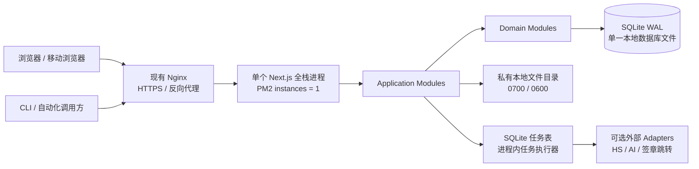
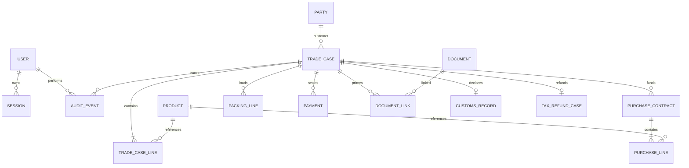
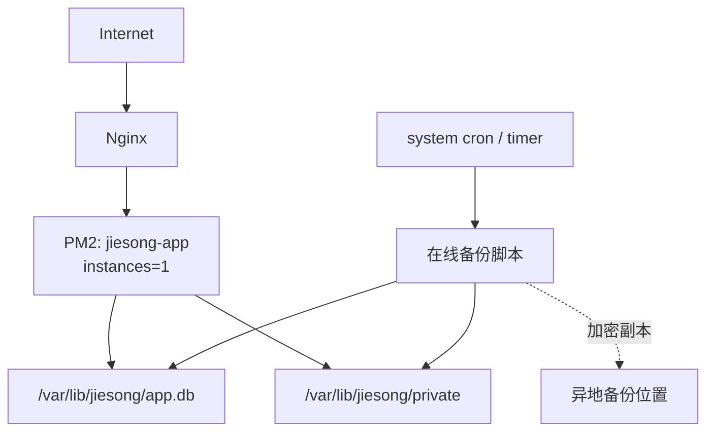
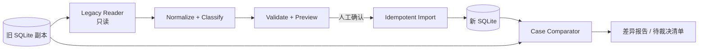

# 捷淞业务执行系统：绿地重建技术架构方案

> 文档状态：V0.2，SQLite 单服务器方案
>
> 基线日期：2026-07-31
>
> 产品范围见 [PRD.md](./PRD.md)。

## 1. 架构结论

绿地版采用 **TypeScript 模块化单体 + 服务器本地 SQLite + 私有文件目录 + 单个 Next.js 全栈进程**。

首版不引入 PostgreSQL、Redis、S3/MinIO、消息队列、独立 Worker 或微服务。现有 Nginx 与 PM2 可以继续使用，但它们只负责 HTTPS/反向代理和进程守护，不承载业务状态。



业务运行面只有：

1. 一台 Linux 服务器；
2. 一个 Node.js / Next.js 进程；
3. 一个 SQLite 数据库文件；
4. 一个私有附件目录；
5. 一套定时备份脚本。

异地备份是灾备要求，但不是在线运行依赖。AI、HSCIQ 等外部能力不可用时，核心业务仍能人工完成。

## 2. 为什么 SQLite 更适合当前阶段

当前产品符合 SQLite 的优势区间：

- 内部系统、用户数量少、写入频率低；
- 只部署在一台 VPS，不需要多实例同时写；
- 主要数据是合同、商品、装箱、收付和附件元数据，不是高吞吐事件流；
- 当前本机和 VPS 已有 Prisma + SQLite 的真实运行经验；
- 绿地版的首要目标是缩短交付周期和降低维护成本，而不是预先解决尚不存在的水平扩展问题。

SQLite 在这里不是临时数据库，而是首版正式生产数据库。只要单机、单写进程和低并发前提成立，就不安排数据库迁移项目。

## 3. 明确不引入的运行依赖

| 不引入 | 原因 | 当前替代方案 |
|---|---|---|
| PostgreSQL | 增加安装、连接池、权限、备份和升级维护 | SQLite WAL 单文件 |
| Redis | 当前没有跨实例缓存、分布式锁或高吞吐队列需求 | 进程内缓存 + SQLite 任务表 |
| S3 / MinIO | 单服务器附件量可控，引入对象存储会扩大权限和运维面 | 服务器私有文件目录 |
| 消息队列 | 任务规模小，无需独立基础设施 | 持久化任务表 + 进程内执行器 |
| 独立 Worker | 首版无需单独部署、监控和发布第二个进程 | 同一进程中限并发执行任务；CPU 任务用 `worker_threads` |
| 微服务 | 八阶段需要强事务，小团队不需要独立扩缩容 | 模块化单体 |
| Kubernetes / Docker 编排 | 单机运行没有集群调度收益 | PM2 + Nginx + 部署脚本 |

Docker 只可用于开发环境复现，不作为生产运行前提。

## 4. 架构原则

1. **专项单是业务根**：采购、装箱、单证、发票和结清都从专项单进入。
2. **一个进程、一套规则**：页面、HTTP Interface、任务执行共享同一组 TypeScript 命令和 Zod Schema。
3. **状态由事实推导**：Workflow Module 从业务事实计算阶段和下一动作，不维护八组重复布尔值。
4. **写入命令化**：权限、校验、事务、审计、幂等和下一动作在一个命令中完成。
5. **单写进程**：PM2 必须保持 `instances: 1`，禁止 cluster 模式和多服务器共享同一个数据库文件。
6. **文件本地但不随代码发布**：数据库和附件放在独立持久化目录，不能放进 release 目录或 Git。
7. **先备份再迁移**：任何 Schema 变更先生成在线备份，再执行受审查的 migration；禁止 `prisma db push`。
8. **外部能力可关闭**：AI、在线 HS、签章跳转和通知失败不能阻断事实保存。
9. **达到触发线再升级**：不为假设中的规模预埋外部数据库或中间件。

## 5. 技术选型

| 领域 | 选择 | 原因 |
|---|---|---|
| 语言 | TypeScript 严格模式 | 消除当前 JavaScript/TypeScript 两套业务类型 |
| Web | Next.js 16 App Router + React 19 | 页面、服务器渲染和 HTTP Adapter 同仓 |
| UI | Tailwind CSS + shadcn/ui | 沿用现有设计规范，减少自建 UI |
| 校验 | Zod | 表单、命令、导入和外部 Interface 共用 Schema |
| 数据库 | SQLite 3，WAL 模式 | 单机、低并发、事务可靠、备份简单 |
| 数据访问 | Prisma，固定 SQLite Provider | 复用现有经验；只维护一种数据库语义 |
| 会话 | SQLite 会话 + HttpOnly/Secure/SameSite Cookie | 可撤销、可审计，不使用长效 JWT 作为浏览器会话 |
| 密码 | Argon2id | 成熟密码哈希 |
| 文件 | 服务器私有目录 | 不增加对象存储依赖；权限和备份路径明确 |
| 后台任务 | SQLite 任务表 + 进程内执行器 | 可重试、重启可恢复，不增加队列中间件 |
| 搜索 | SQLite 普通索引 + FTS5 | 足够承载商品、合同和约 1.5 万条 HS 数据 |
| 测试 | Vitest + 临时 SQLite + Playwright | 贴近真实运行且启动快 |
| 日志 | Pino JSON 日志 | 只记录结构、状态与耗时，不记录敏感正文 |

## 6. SQLite 运行约束

### 6.1 强制配置

每个数据库连接必须执行或验证：

```sql
PRAGMA foreign_keys = ON;
PRAGMA journal_mode = WAL;
PRAGMA synchronous = FULL;
PRAGMA busy_timeout = 5000;
```

- `foreign_keys=ON`：避免产生孤儿记录。
- `WAL`：读取不阻塞写入，适合内部系统常见的多读少写。
- `synchronous=FULL`：优先保证业务提交在异常断电时的可靠性。
- `busy_timeout`：短写冲突等待，而不是立即向用户暴露 `SQLITE_BUSY`。

### 6.2 禁止事项

- 不把数据库放在 NFS、SMB、网盘同步目录或容器临时层。
- 不让多个 PM2 实例、多个服务器或临时脚本同时成为写入方。
- 不在数据库写入期间直接 `cp app.db` 作为备份。
- 不手工改真实数据库表结构；只通过备份优先的 migration。
- 不把 PDF、Excel 和图片二进制内容写入 SQLite BLOB。

### 6.3 金额与精度

SQLite 没有真正的固定精度金额类型，因此绿地版：

- CNY/USD 金额保存为最小货币单位整数，例如 `amountMinor`；
- 汇率保存为放大后的整数，例如 `exchangeRateMicros`；
- 每个金额字段同时保存币种；
- 只在展示层格式化为小数，禁止业务规则使用 JavaScript 浮点直接累计金额。

## 7. Module 划分

| Module | Interface 职责 | 主要实现 |
|---|---|---|
| Identity | 登录、登出、会话、角色和权限判断 | 用户、会话、权限策略 |
| Trade Case | 创建专项单、执行八阶段命令、查询下一动作 | 采购、生产、装箱、单证、发票、退税规则 |
| Finance | 收付、汇率快照、毛利、结清和账期导入 | 分币种账目、匹配、财务投影 |
| Master Data | 往来方、商品、港口、HS 资料 | 主数据、别名、来源和有效期 |
| Evidence | 上传、分类、校验、下载、保留和追溯 | 本地文件、哈希、元数据、解析结论 |
| Migration | 预览、差异、幂等导入和拒绝清单 | 旧 SQLite Reader、来源键、导入批次 |
| Audit & Jobs | 操作审计、站内提醒和任务状态 | 追加审计、任务表、通知投影 |

AI 不成为一级 Module。它是 Trade Case、Master Data 和 Finance 内部可关闭的 Adapter。

### 7.1 Trade Case Module 的深 Interface

```ts
type TradeCaseCommand =
  | CreateTradeCase
  | LinkPurchaseContract
  | RecordPurchasePayment
  | CompleteProduction
  | UpdatePackingPlan
  | ConfirmShipment
  | RecordDocumentCheck
  | RecordSupplierInvoice
  | AdvanceTaxRefund
  | RecordReceipt
  | CloseTradeCase;

executeTradeCaseCommand(command, actor): Promise<CommandReceipt>;
getTradeCaseWorkspace(id, actor): Promise<TradeCaseWorkspace>;
```

`CommandReceipt` 包含是否提交、专项单版本、阶段变化、下一动作、审计编号和任务编号。失败时必须明确 `committed: false`。

### 7.2 真实 Seam

- `HsEvidenceSource`：本地税则快照 / HSCIQ 两个 Adapter。
- `AiAssistant`：禁用 Adapter / OpenAI-compatible Adapter。
- `LegacyReader`：旧 SQLite / 标准导出包两个 Adapter。

文件首版只有本地实现，不为假设中的对象存储提前设计外部 Seam。

## 8. 代码组织

```text
src/
  app/                         # Next.js 页面与 Route Handlers
  modules/
    identity/
    trade-case/
    finance/
    master-data/
    evidence/
    migration/
    audit-jobs/
  contracts/                   # Zod Schema、错误码、外部 Interface 类型
  infrastructure/
    sqlite/
    local-files/
    external-adapters/
  ui/                          # shadcn/ui 与产品级复用 UI
prisma/
  schema.prisma
  migrations/
scripts/
  backup/
  migration/
data/                          # 本地开发数据；全部 Git ignore
docs/
  adr/
  runbooks/
```

页面不得直接访问 Prisma；旧兼容规则只能存在于 Migration Module；生产数据目录不得位于应用 release 目录中。

## 9. 数据架构



### 9.1 建模规则

- `trade_case` 只保存稳定身份、负责人、目的地、日期和乐观锁版本。
- 阶段和下一动作由 Workflow Module 推导；`workflow_projection` 是可重建的列表投影。
- 状态使用受约束字符串和 Domain Module 校验；SQLite Schema 同时增加 `CHECK` 约束。
- 附件表只存相对路径、SHA-256、大小、MIME、分类、敏感级别和保留策略，不存公开 URL。
- 导入保存 `sourceSystem + sourceKey + sourceHash`，重复运行不制造重复事实。
- JSON 只用于不参与关键关联的扩展元数据，并在进入 Module 时经 Zod 校验。
- 审计追加写；不采用 Event Sourcing。

### 9.2 事务与并发

- 每个命令在一个短 SQLite 事务内完成事实、版本、投影、审计和任务记录。
- 文件解析、Excel 生成和 AI 调用不得放在数据库事务中。
- 更新专项单必须携带 `expectedVersion`；版本冲突返回可重试错误，不静默覆盖。
- 写事务禁止等待外部网络；外部调用先记录任务，提交后再执行。
- 大批量导入先完整解析与预览，再按来源文件原子写入。

## 10. 文件与后台任务

### 10.1 持久化目录

建议使用独立于代码发布目录的路径：

```text
/var/lib/jiesong/
  app.db
  private/
    contracts/
    customs/
    invoices/
    exports/
  quarantine/
/var/backups/jiesong/
```

- `/var/lib/jiesong`、`private`、`quarantine` 为 `0700`；
- 业务文件为 `0600`；
- 文件名使用系统生成 ID，原始文件名仅作为数据库元数据；
- 应用只接受相对对象键，防止路径穿越；
- 同一文件通过 SHA-256 去重，但不同业务引用独立保留。

### 10.2 上传流程

1. Web 将上传流写入 `quarantine` 临时文件，限制大小并同步计算 SHA-256。
2. 校验文件头、扩展名、MIME、格式和权限。
3. 校验通过后原子移动到 `private`，再在短事务中建立 `document` 关联。
4. 任何权限收紧或原子移动失败都返回 `committed: false`。
5. 失败临时文件由定时清理任务删除，不进入普通附件目录。

### 10.3 任务执行

- `jobs` 表保存类型、输入引用、状态、尝试次数、下次执行时间和结果摘要。
- 同一 Next.js 进程以小并发轮询并领取任务；领取与状态变更在事务中完成。
- PDF/Excel/AI 任务重启后可继续；任务必须有幂等键。
- CPU 密集解析使用 Node `worker_threads`，避免阻塞页面请求，但仍不增加部署进程。
- 任务失败不会把业务事实回滚成假状态；页面显示失败原因和重试动作。

## 11. 权限与安全

- 默认拒绝；每个命令和查询通过集中策略检查，页面隐藏不能代替权限。
- 财务行级资料仅管理员和财务可读；业务经办只看专项单必要摘要。
- 文件下载经过登录、权限与业务引用检查，再由应用流式返回；不暴露真实磁盘路径。
- 密钥只通过环境注入；任何 Interface 只返回 `configured` 或掩码后缀。
- 日志只保留路由模板、字段结构/数量、状态和耗时；不记录正文、查询值、AI 提示、密钥或财务明细。
- 数据库、附件和备份目录不进入 Git、构建产物或普通下载目录。
- Restricted / Confidential / Internal / Public 分类继续适用。

## 12. 备份、恢复与迁移

### 12.1 备份

- 每次 Schema migration 前强制创建在线一致性备份。
- 每日使用 SQLite Online Backup Interface 或 `VACUUM INTO` 生成数据库快照，不直接复制正在写入的 `app.db`。
- 附件按内容哈希增量备份，并生成数据库快照与附件清单的同批次 manifest。
- 本机保留最近 7 个日备份；另保留一份加密异地副本。异地目标不参与在线运行。
- 每月抽取一个备份到隔离目录执行恢复演练和 `quick_check`。

### 12.2 恢复

1. 停止 PM2 应用进程，阻断写入。
2. 校验目标备份的哈希、manifest 和附件完整性。
3. 将当前数据目录整体移动到隔离位置，不直接覆盖。
4. 恢复数据库与附件，执行 `PRAGMA quick_check` 和 `PRAGMA foreign_key_check`。
5. 启动应用并验证健康、登录、专项单计数和最近审计事件。

### 12.3 Schema migration

- 只使用 `npm run db:migrate` 或生产等价的备份优先命令。
- 禁止直接运行 `prisma db push`。
- migration 必须可在旧库副本上完整演练，并记录前后行数、外键检查和关键查询结果。
- 失败时恢复整个数据库文件和对应附件 manifest，不做半迁移修补。

## 13. 部署与健康检查

### 13.1 部署拓扑



- PM2 只运行一个应用实例，关闭 cluster。
- Nginx 继续负责 HTTPS、上传大小限制和反向代理。
- 部署只替换代码和构建产物，不覆盖 `/var/lib/jiesong`。
- 部署顺序：备份 → 安装依赖 → 构建 → migration → PM2 重启 → 健康检查。

### 13.2 健康检查

- `/health/live`：进程存活。
- `/health/ready`：数据库可读写、migration 版本正确、私有目录权限正确。
- 定时巡检：`quick_check`、外键异常、WAL 大小、备份年龄、任务积压、磁盘余量。
- 业务健康：无下一动作专项单、投影漂移、未匹配导入和附件缺失数量。

## 14. 外部 Adapter 与降级

| Adapter | 正常模式 | 降级模式 | 禁止行为 |
|---|---|---|---|
| HS 在线源 | 获取归类实例、详情和申报要素 | 使用带版本日期的本地 SQLite 快照 | 把 AI 推断显示为官方来源 |
| AI | 生成候选、解释差异、解析输入 | 关闭并保留人工录入 | 自动确认付款、HS、报关、退税或结清 |
| 电子签章 | 跳转已配置平台，等待人工归档 | 下载待签文件，稍后上传盖章件 | 仅因打开页面就标记已签 |
| 通知 | 站内通知 | 工作台待办继续可见 | 通知失败阻断事实保存 |
| 汇率 | 使用已配置来源并保存快照 | 人工录入并标记来源 | 用最新汇率改写历史专项单 |

## 15. 测试策略

| 层级 | 重点 | 门禁 |
|---|---|---|
| Domain Module | 八阶段、80%/超限、币种、状态和下一动作 | 所有规则分支覆盖 |
| Application Module | 权限、事务、幂等、版本冲突、审计和任务 | 临时 SQLite 集成测试 |
| SQLite | WAL、外键、金额整数、忙等待、备份恢复 | 真实文件数据库测试，不只用内存库 |
| 文件 | 权限、路径穿越、原子移动、哈希、引用与清理 | 受限临时目录集成测试 |
| Adapter | HS、AI、旧库读取 | 正常、禁用、超时和错误契约测试 |
| 浏览器 | 创建、阻塞修复、发运、结清、导入预览 | Playwright 核心旅程 |
| 迁移 | 行数、金额、阶段、附件和来源键 | 逐专项单差异为 0 或有批准解释 |
| 安全 | 越权、恶意上传、日志泄露、密钥回显 | 发布前强制通过 |

## 16. 旧系统迁移



- 旧数据库和工作簿只读，不回写。
- 新旧都是 SQLite，但 Schema 不同，必须通过 Legacy Reader 显式映射，不能直接复制旧库冒充迁移。
- 先迁主数据，再迁专项单、财务事实和附件元数据，最后重建工作流投影。
- 证据不足的数据进入 `needs_review`，不编造门店、HS、金额、海关编号或完成状态。
- 原始工作簿不复制到普通附件区；敏感财务行入库前脱敏。
- 每批保存 `sourceSystem + sourceKey + sourceHash`，可安全重复执行。
- 切换后旧系统立即只读，禁止双写。

## 17. 性能预算与升级触发线

### 17.1 首版预算

- 普通查询 P95 < 300ms；普通写入 P95 < 800ms。
- 工作台读取投影，不在首屏联表重算全部历史事实。
- 任务提交 300ms 内返回持久化回执；长任务异步完成。
- 生产数据库每日监控大小、WAL、慢查询和 `SQLITE_BUSY` 次数。

### 17.2 只有出现以下事实才评估外部数据库

- 业务必须运行多个应用实例或多台服务器同时写入；
- 在索引和事务已优化后，仍持续发生写锁超时或 `SQLITE_BUSY`；
- 普通写入 P95 连续超出 800ms，且根因是写并发而非页面或外部调用；
- 报表查询持续影响日常写入，无法通过投影、索引或离线导出解决；
- 数据库备份/恢复时间超过确认的 RTO；
- 出现明确的高可用自动故障转移要求。

达到触发线后再写 ADR 和迁移方案。Domain Module 与命令 Interface 不因数据库替换而改变；首版不预建第二套数据 Adapter。

## 18. 分阶段实施

| 阶段 | 目标 | 交付 | 完成门禁 |
|---|---|---|---|
| G0 领域基线 | 固化规则和迁移口径 | 数据字典、状态机、旧库 Reader、差异基线 | 关键规则有来源和样例 |
| G1 单机骨架 | 建立可部署最小系统 | 单 Next.js、SQLite、私有文件、身份、审计、备份 | 构建、迁移、恢复、权限全绿 |
| G2 执行主线 | 打通前四阶段 | 采购签约、付款、生产、排柜出货 | 正常与阻塞旅程通过 |
| G3 单证与结清 | 打通后四阶段 | HS、三表、PDF 核对、发票、退税、财务 | 三笔专项单端到端通过 |
| G4 迁移与切换 | 新系统接管真实业务 | 全量只读迁移、影子比对、回滚演练 | 14 天无 P0/P1 差异 |
| G5 收尾 | 降低长期维护成本 | 旧系统只读归档、脚本清理、运行手册 | 无双写、无未归属数据 |

## 19. 关键取舍

| 决策 | 收益 | 代价 / 限制 |
|---|---|---|
| SQLite 正式生产 | 交付快、部署和恢复简单、无外部数据库运维 | 必须单机、单写进程，不支持水平扩展 |
| 本地私有附件 | 无对象存储成本和权限链路 | 必须把附件纳入备份、磁盘监控和恢复演练 |
| 单 Next.js 进程 | 发布面最小，类型与规则集中 | 长任务必须限并发，CPU 任务需 worker thread |
| SQLite 任务表 | 重启可恢复，无队列中间件 | 不适合高吞吐或多机器消费 |
| 金额整数化 | 避免 SQLite/JavaScript 浮点误差 | 读取和展示需要统一换算 Module |
| 状态推导 + 投影 | 避免状态漂移，列表仍快速 | 需要投影重建和一致性巡检 |
| AI 作为内部 Adapter | 核心流程不依赖模型和网络 | 不设置独立展示型 AI 入口 |

## 20. 进入 G0/G1 前只需确认三件事

1. 生产数据目录最终采用 `/var/lib/jiesong`，还是沿用服务器已有的独立持久化目录？
2. 加密异地备份落到哪台机器或哪个已有存储位置？这不影响在线运行。
3. 首批迁移范围以及财务分析资料库进入 P0 还是 P1。
