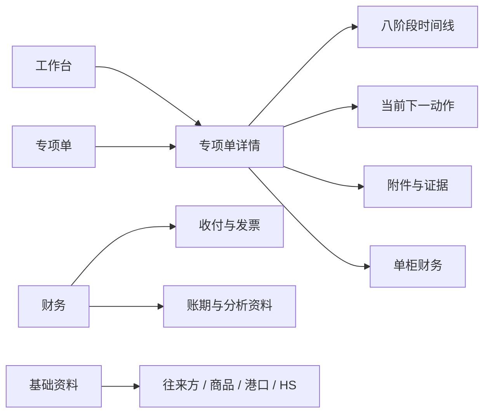

# 捷淞业务执行系统：绿地重建版 PRD

> 文档状态：V0.1，可进入架构评审
>
> 基线日期：2026-07-31
>
> 目标读者：业务负责人、产品、设计、工程
>
> 本文定义“重建什么”；技术实现见 [ARCHITECTURE.md](./ARCHITECTURE.md)。

## 1. 执行摘要

捷淞业务执行系统不是一套通用进销存，也不应继续扩张成小型 ERP。它的核心价值是：

> 以一笔出口专项单为唯一工作对象，把采购签约、付款、生产资料、排柜出货、出口单证、供应商发票、退税准备和财务结清串成一条可追溯主线，并始终告诉经办人“现在唯一该做什么”。

绿地版不复制当前 56 个前端页面、33 个路由 Module、58 个后端业务实现和 51 个持久化模型。它只继承已验证的业务规则、证据链和真实数据，重新构建更小的产品表面。

首版只有四个主入口：

1. **工作台**：看全部专项单、阻塞、下一动作和经营摘要。
2. **专项单**：完成一笔业务从签约到结清的八阶段执行。
3. **财务**：处理收付、发票、退税和账期分析。
4. **基础资料**：维护供应商、客户/门店、商品、港口、HS 编码等复用资料。

账号、系统参数、审计与导入工具进入右上角管理菜单；AI 只在具体任务中提供辅助，不再作为一级业务入口。

## 2. 为什么重建

### 2.1 当前产品已证明的价值

- 出口专项单已经能聚合关联采购合同、装箱、单证、发票、退税和收付事实。
- 八阶段主线及“唯一下一动作”已经形成可用的工作台模型。
- 40HQ 排柜、双 80% 出柜判断、HS 来源证据、船司 PDF 核对、月报预览确认等关键规则已经过真实业务验证。
- 财务资料可以按来源、账期和明细下钻，并有敏感信息脱敏与角色控制。

### 2.2 当前产品的结构性问题

- **产品表面大于核心任务**：大量列表、兼容路由、独立工具页和重复入口，让用户仍需理解系统结构，而不是直接完成业务。
- **同一业务事实跨多个模型拼接**：专项单进度需要从出口合同、采购合同、装箱明细、附件、报关、退税、付款等位置即时推导，维护成本高。
- **前后端分离带来重复 Interface**：类型、校验、错误语义和状态规则容易在浏览器与后端两边漂移。
- **历史导入逻辑进入主仓库**：大量一次性脚本、兼容字段和旧路径判断掩盖了长期产品代码。
- **“功能存在”不等于“流程完成”**：页面可达、文件已选或外部链接已打开，都不能证明业务事实已写入并通过校验。

### 2.3 重建目标

- 让新用户不学习系统结构也能处理业务。
- 把核心工作路径从“找页面”改为“按下一动作推进”。
- 让规则、状态、证据和权限集中在少量深 Module 中。
- 让导入、AI、外部平台都成为可替换 Adapter，不侵入业务主线。
- 建立可核对、可回滚的迁移方式，不在切换时重写或猜测历史事实。

## 3. 产品定位与边界

### 3.1 产品定位

面向小型出口贸易执行团队的内部业务协同系统。它承接从国内采购到出口结清的事实、动作、凭证与经营视图，但不替代银行、税务、海关、电子签章或专业会计软件。

### 3.2 目标用户

| 角色 | 核心诉求 | 默认权限 |
|---|---|---|
| 负责人 / 管理员 | 看业务卡在哪里、资金是否收付、单柜是否盈利 | 全部摘要；管理配置与账号 |
| 业务经办 | 推进采购、生产、装箱、单证和催票 | 创建与维护专项单；看必要财务状态 |
| 财务 | 登记收付、核对发票、准备退税、导入账期资料 | 财务明细；受限业务事实；敏感资料下钻 |

仓库、采购、销售等旧角色不在首版继续细分。只有出现真实的职责隔离需求时才新增角色。

### 3.3 非目标

- 不建设通用 ERP、WMS、CRM 或会计总账系统。
- 不直接提交海关、税务、银行或签章平台操作。
- 不建设多租户 SaaS、插件市场或通用 Agent 平台。
- 不为所有历史格式永久保留在线编辑界面；历史资料优先只读归档。
- 不用 AI 自动确认 HS 编码、税率、付款、报关、退税或结清。
- 不在 MVP 支持多种柜型和复杂装载优化；先固定 40HQ 规则。

## 4. 核心产品模型

### 4.1 唯一主对象：出口专项单

每个专项单对应一个 `EXP` 业务编号和一个主要发运批次。它关联客户/门店、目的港、商品、销售明细、一份或多份采购合同、生产及箱规、装箱与单证、供应商发票、退税资料、人民币成本、美元收款和毛利。

### 4.2 八阶段主线

| 阶段 | 关键输入 | 系统判定 | 完成标志 | 主要输出 |
|---|---|---|---|---|
| 1. 采购签约 | 采购合同、供应商、盖章件 | 合同是否关联、签约、归档 | 所有关联采购合同已签约且盖章件可追溯 | 已锁定采购范围 |
| 2. 采购付款 | 合同金额、定金/尾款 | 已付与待付是否一致 | 采购款已付清或有明确例外 | 应付状态 |
| 3. 生产与资料 | 规格、箱数、毛净重、体积 | 必填资料是否齐全 | 生产完成且装箱输入完整 | 可用于排柜的货物事实 |
| 4. 排柜与出货 | 箱规、重量、体积、3D 排柜 | 是否超限、是否全部装下、利用率是否达标 | 全部箱件可装下并确认发运 | 发运事实与柜内明细 |
| 5. 出口单证 | HS、申报要素、三表、船司装箱单 | 单证是否齐、船司核对是否通过 | 报关记录存在且最新核对通过 | 可追溯出口单证包 |
| 6. 供应商发票 | 采购发票号码/原件 | 关联采购是否全部有票 | 所有关联采购已登记发票号码 | 退税发票清单 |
| 7. 退税准备 | 报关、发票、收汇、备案资料 | 材料是否齐、是否进入申报 | 退税记录进入申报或后续状态 | 退税准备包与提醒 |
| 8. 财务结清 | 采购付款、美元收款、汇率、退税 | 成本和收入是否闭合 | 采购付清、销售收齐；差异已解释 | 单柜毛利与结清记录 |

### 4.3 关键规则

- 一笔专项单在任意时刻只展示一个最高优先级“下一动作”。阻塞动作优先于普通待办。
- 所有阶段结果由已保存的业务事实推导；页面打开、文件选择或外部跳转不算完成。
- 40HQ 默认安全上限为毛重 22 吨、体积 68 CBM；任一利用率达到 80% 且全部箱件可装下时，允许进入确认发运。超限或存在未装箱件时必须阻塞。
- 箱长、宽、高缺失时，可由总体积和箱数生成可视化估算，但必须标识“估算”，不能覆盖正式资料。
- HS 推荐必须展示来源、适用日期、申报要素来源和仍需人工确认的字段。AI 结论不能伪装成官方结论。
- USD 收入与 CNY 成本不直接相加；必须保存使用的汇率和日期。
- 退税提醒日期只作为内部准备节点；法定期限以当期税务规则和主管机关要求为准。
- 财务导入必须经历“解析预览 → 异常提示 → 明确覆盖 → 单事务写入”。
- 每个关键写入记录操作者、时间、前后差异和来源；源文件与结构化结论保持可追溯关系。

## 5. 信息架构

### 5.1 工作台

- 默认按“阻塞 → 当前 → 待办 → 已完成”排序专项单。
- 每张卡片只展示编号、客户/港口、八阶段进度、阻塞原因、下一动作和核心资金状态。
- 负责人可切换经营摘要；经办人默认只看自己负责或需要自己处理的专项单。

### 5.2 专项单详情

- 顶部固定展示编号、状态、目的地、发运日期、负责人和异常提示。
- 主区展示八阶段时间线；点击当前阶段进入该阶段表单。
- 右侧或移动端底部展示唯一主按钮，不同时出现多个同级“下一步”。
- 历史操作、附件和财务摘要作为详情内页签，不再拆成多个一级页面。

### 5.3 财务与基础资料

- 财务以“待收、待付、待票、待退税、待对账”五个队列组织工作。
- 单柜财务从专项单事实生成；公司级账期只做汇总和下钻。
- 原始流水、发票和财务资料先进入待匹配区，人工确认后才关联专项单。
- 往来方统一承载供应商、客户、门店等身份；商品只保存稳定属性，价格、HS 证据和箱规均保留有效期或来源。

## 6. MVP 功能范围

### 6.1 P0：首个可替代版本

1. 账号登录、三角色权限、会话管理。
2. 专项单创建、列表、详情、负责人和八阶段状态。
3. 供应商、客户/门店、商品、港口基础资料。
4. 采购合同关联、盖章件归档、定金/尾款和生产资料。
5. 40HQ 装箱明细、双 80% 判断、超限阻塞和简化 3D 预览。
6. HS 本地检索、来源证据、申报要素、出口三表生成。
7. 船司装箱单上传、结构化对比、差异确认。
8. 供应商发票号码、退税材料清单和内部提醒。
9. 美元收款、人民币成本、汇率快照、单柜毛利和结清。
10. 文件安全存储、操作审计、通知中心。
11. 旧系统只读迁移、差异报告、可重复导入。

### 6.2 P1：稳定后补充

- 银行流水与发票批量导入、自动匹配建议。
- 月度三表、科目余额、明细账和财务分析资料库。
- 合同 Word/PDF 模板生成与签章平台跳转。
- 任务内 AI：合同解析、HS 候选、差异解释、经营问答。
- 更完整的移动端现场操作与离线草稿。

### 6.3 P2：有真实需求再做

- 多柜拆分/合柜、多柜型装载优化。
- 外部平台自动提交 Adapter。
- 供应商自助上传入口。
- 更细角色、审批流和跨公司协作。

## 7. 核心用户故事与验收

| 编号 | 用户故事 | 验收标准 |
|---|---|---|
| US-01 | 作为业务经办，我想打开工作台就知道先做什么 | 每笔未完成专项单恰好一个下一动作；动作可直达对应表单；阻塞原因可读 |
| US-02 | 作为业务经办，我想一次录入生产与箱规资料 | 必填项齐全才允许完成生产；缺失项逐行指出；估算尺寸明确标记 |
| US-03 | 作为负责人，我想知道这个柜能否发运 | 系统同时校验重量、体积、未装箱件和 3D 可放置性；任何超限均阻塞 |
| US-04 | 作为单证人员，我想知道 HS 推荐是否可信 | 每个候选显示来源、日期、要素模板和待确认字段；无可靠来源时明确降级 |
| US-05 | 作为财务，我想确认每个柜是否收付闭合 | 分币种展示合同额、已收/付、差额和汇率；不能把不同币种直接合并 |
| US-06 | 作为财务，我想安全导入月度资料 | 写入前可预览、看异常、确认覆盖；任何校验失败都不产生部分写入 |
| US-07 | 作为管理员，我想追溯关键修改 | 可按专项单查看谁在何时修改了什么；日志不包含密钥、完整提示词或敏感正文 |
| US-08 | 作为迁移负责人，我想证明新旧系统一致 | 同一历史专项单的金额、阶段、附件计数和下一动作可生成机器差异报告 |

## 8. 体验与性能要求

- 桌面为主、移动可完成关键登记；UI 统一采用 shadcn/ui 风格与 Token。
- 生产环境普通页面首个可操作内容 P75 小于 1.5 秒；普通保存 P95 小于 800ms。
- PDF/Excel/AI 等长任务 300ms 内返回任务回执，并显示可恢复进度；不伪装成同步完成。
- 列表默认分页 20 条，可切换 50/100；筛选进入 URL，支持刷新与回退。
- 所有失败提示同时说明“发生了什么、数据是否写入、下一步怎么处理”。
- 无障碍基线：键盘可达、焦点可见、表单错误可被读屏识别、正文对比度达 WCAG AA。

## 9. 成功指标

- 90% 以上日常操作从工作台或专项单详情发起。
- 新专项单从创建到出现正确下一动作不超过 3 分钟。
- 每笔进行中专项单的“无下一动作”比例为 0。
- 需要跨 3 个以上页面才能完成的高频任务为 0。
- 核心状态机分支测试覆盖 100%。
- 所有关键写入具备幂等键或并发版本检查。
- 受限附件和财务行级数据越权测试 100% 通过。
- 新旧系统影子比对连续 14 天无 P0/P1 数据差异后才允许切换写入。

## 10. 发布与迁移策略

1. **基线冻结**：冻结旧系统模型解释，不再新增平行入口，只修 P0 数据和安全问题。
2. **只读镜像**：新系统从旧库导入脱敏后的结构化事实，生成逐专项单差异报告。
3. **试点写入**：选取 3—5 笔新专项单在新系统执行，旧系统只读对照。
4. **财务复核**：收付、发票、退税和单柜毛利由财务逐笔签收。
5. **切换**：新系统成为唯一写入口；旧系统保留只读查询和导出。
6. **退役**：完成法定/业务留存后，归档旧应用与一次性导入脚本。

切换失败时，停止新写入，导出切换窗口内的命令和附件清单，按专项单回放到旧系统；禁止双边继续写入。

## 11. MVP 完成定义

- 四个主入口和八阶段主线可在桌面与移动端使用。
- 至少 3 笔真实结构的测试专项单完整走通，覆盖正常、阻塞、历史补录三类情形。
- 采购付款、装箱、单证、发票、退税和财务结清均有自动化验收。
- 历史数据只读迁移可重复运行，金额/数量/附件/阶段差异全部可解释。
- 生产构建、类型、Lint、单元、集成、浏览器验收、权限和迁移检查全部通过。
- 运维手册、数据字典、回滚手册和关键规则说明可供另一位工程人员独立执行。

## 12. 待业务负责人确认

这些问题不阻塞 V0.1 架构，但会影响 MVP 排期：

1. 首批切换只覆盖 2026 年新业务，还是需要迁移全部历史专项单？
2. 财务三表与分析资料库是否必须进入 P0，还是允许旧系统只读保留到 P1？
3. 采购、业务、财务是否确有必须隔离的写权限，还是三角色已经足够？
4. 首版是否只支持“一笔 EXP 对应一个主要 40HQ 发运批次”？
5. 线上签章继续采用人工跳转，还是已有可稳定接入的正式 Interface？
