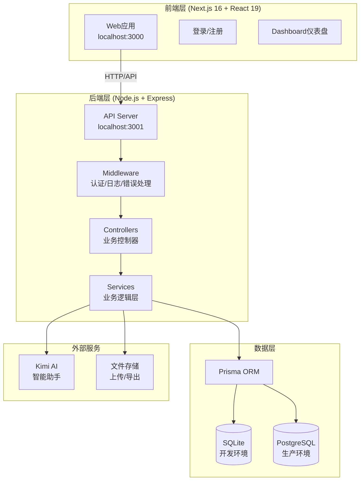
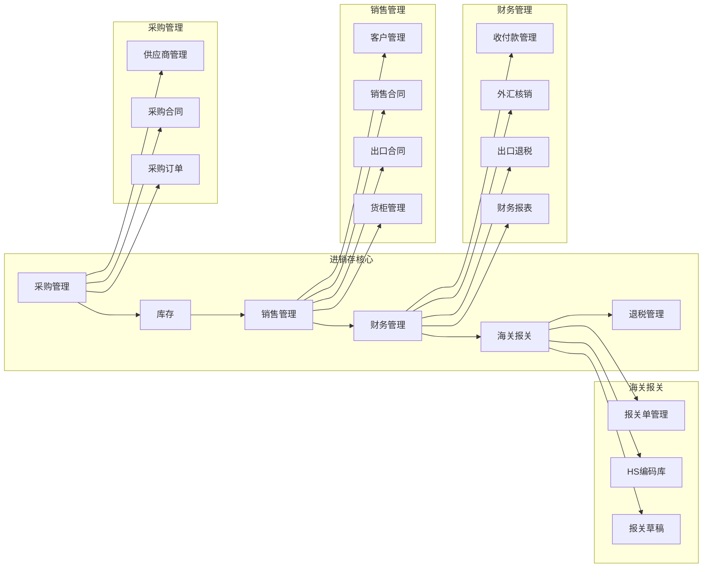
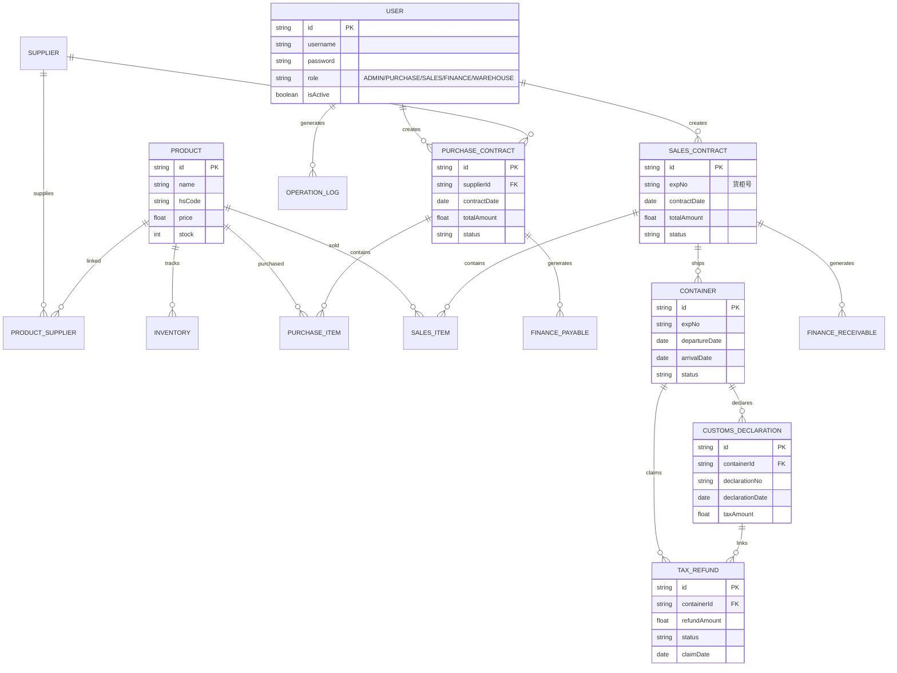
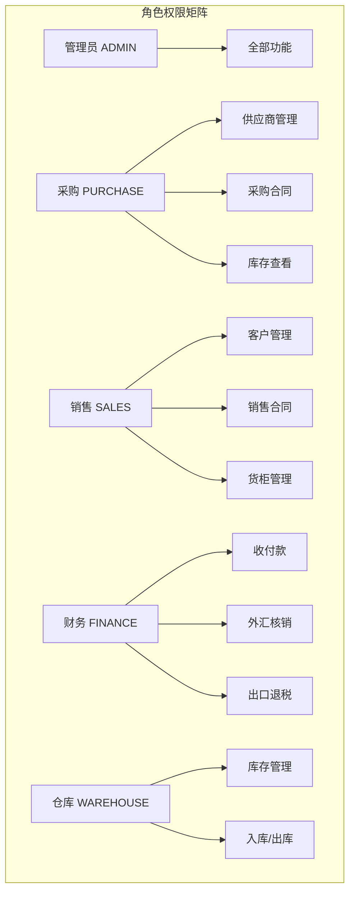
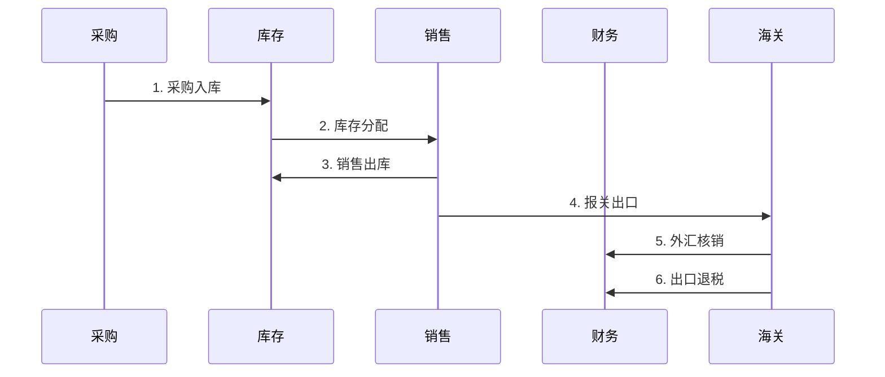

# 捷淞进销存系统 - 系统架构图

## 1. 整体架构

## 2. 核心业务模块

## 3. 数据实体关系

## 4. 用户角色权限

## 5. 业务流程

---

## 功能清单

| 模块 | 功能 |
|------|------|
| **认证** | 登录/注册/找回密码/角色权限 |
| **采购** | 供应商管理、采购合同、采购订单 |
| **销售** | 客户管理、销售合同、出口合同、货柜管理 |
| **库存** | 实时库存、库存预警、入库/出库 |
| **财务** | 应收应付、外汇核销、出口退税、报表 |
| **海关** | 报关单、HS编码库、报关草稿生成 |
| **AI助手** | Kimi智能对话、数据分析、合同生成 |
| **系统** | 用户管理、日志审计、数据导入导出 |
