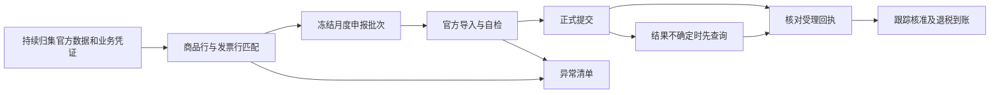

# 出口退税自动化方案

目标：常规业务自动完成资料归集、匹配、申报准备、线上自检、正式申报、回执跟踪和到账核对；平台强制身份验证及业务异常交给指定人员处理。

当前状态：已完成代码调查、官方规则核对及现有相关测试；尚未实现月度自动任务，未登录企业税务账户，未提交真实申报。下述实施顺序是方案，不代表功能已上线。

## 适用范围与待确认信息

根据现有退税准备 Module，暂按外贸企业、一般贸易货物、免退税办法设计。企业性质、实际备案办法和业务类型仍需核对；生产企业免抵退税不能直接套用本方案。历史业务需按其适用政策分别判断。

首轮联调需要确认：申报主体及主管税务机关所在城市、企业管理类别、当前提交平台、经办人及登录验证方式、内部截止日、目前资料来源。另需在财务受控环境中取得一批已受理业务的官方明细表、回执和对应凭证，作为对照；真实凭证不进入本文件或 Git。

“月初之前”先作为内部备齐材料的目标。报关出口当月的货物通常从次月起申报，因此月底准备和次月正式提交需要分开安排；以前月份已具备条件的业务另行处理。实际运行日期以当地当期申报窗口为准，不写死每月 1—15 日。

## 已核对的政策与官方能力

- 常规报关出口货物的申报窗口为出口次月起至次年 4 月 30 日前的各增值税纳税申报期；补充申报涉及 36 个月限制及收汇材料。免退税的一般外贸货物计税依据取匹配购进凭证金额，不能使用出口销售额。[财政部、税务总局公告 2026 年第 11 号，第四条和第九条](https://fgk.chinatax.gov.cn/zcfgk/c102416/c5247437/content.html)
- 官方提供电子税务局、标准版国际贸易“单一窗口”和离线申报工具。申报后还需整理备案目录，通常为申报后 15 日内、留存 10 年；一般业务不应一律强制等全部收汇后才能准备申报，需区分收汇期限与申报时报送材料的情形。[国家税务总局公告 2026 年第 5 号，第 41—49 条](https://fgk.chinatax.gov.cn/zcfgk/c100012/c5247423/content.html)
- 单一窗口已有报关单采集、发票采集、智能配单、自检和确认申报流程；应优先复用，而不是另造一个退税申报系统。[浙江单一窗口官方操作说明](https://zj.singlewindow.cn/pen-portal/gov/detail.jspa?id=164293)。该说明发布于 2023 年，当前企业账户的菜单、模板与自动功能必须现场复核。

政策依据能证明网上申报渠道存在，不能证明企业可获得直接申报 API，也不能证明账号支持无人值守登录。

## 现有实现与缺口

| 环节 | 已有实现 | 自动提交前需要补齐 |
| --- | --- | --- |
| 资料准备 | `backend/src/services/taxRefundPreparationService.js` 汇总凭证、备案资料和期限 | 区分申报阻塞、备案后续事项、收汇到期事项，确定资料来源与更新频率 |
| 工作台与核验 | `backend/src/services/taxRefundWorkbenchService.js` 聚合合同、报关单、采购发票台账；`invoiceVerificationService.js` 比较销方、金额、品名和正常/正数状态 | 台账一致性不等于税局用途确认、电子信息一致性或最终受理；按实际出口商品行与发票行分配数量和金额 |
| 税务测算 | `backend/src/services/taxCalculationEngine.js` 已采用采购专票口径的预计值 | 保留估算用途；正式申报取真实凭证及对应分配金额，避免以采购成本推算值直接申报 |
| 自动草稿 | `backend/src/services/taxRefundDraftService.js` 按报关商品金额乘 HS 退税率生成草稿 | 与采购凭证口径统一；征税率不得替代缺失退税率；取业务适用日期的有效税率；缺少部分税率不得生成可提交的部分金额 |
| 导出 | `backend/src/services/taxRefundExportService.js` 校验采购合同关联号、发票号及征税率，输出内部 CSV | 目前列名含内部 ID，不能宣称是官方导入文件；需从目标平台下载现行模板并实测进货明细及出口明细的导入、自检 |
| 批次与状态 | `backend/prisma/schema.prisma` 的 `TaxRefund` 有草稿、申请、核准、退税等状态 | 缺少月度批次、线上受理回执和提交结果不确定的恢复依据；草稿 `appliedAt` 不能充当实际申报时间 |
| 线上操作 | 当前工作台明确由财务完成登录、用途确认和正式提交 | 验证现有官方自动功能及授权接口；不足部分再针对实际网页做自动操作 |

另外，自动批次不能直接复用当前页面的候选范围：页面仅加载前 100 条，后端工作台按合同展示最新报关单与最新退税记录。月度任务必须完整枚举未申报的合格业务行，包含以前月份遗漏记录，避免合同多报关单、多批次及分页导致漏报。

## 目标流程



1. **持续归集。** 采购发票、报关单和合同进入现有数据链路；优先采用官方可下载的结构化数据和现有导入能力。OCR 只辅助取字段，AI 不自行确定税率、用途、计税金额或缺失证据。自动下载能否实现取决于登录条件；仅能手工导入时明确标记该人工环节。
2. **匹配与计算。** 在出口商品行和进货凭证行之间分配本次申报数量、金额，核对商品名称、单位、税率及有效日期。合法拆分的发票保留已使用和剩余份额，不能整张重复计入不同批次；无法确定的关系进入异常清单。
3. **形成批次。** 按主体、申报年月和批次管理，冻结明细与税率依据，列出可申报、缺件、待信息同步和需特殊处理的业务。业务数据变化后重新核验；不覆盖或删除已提交记录。现有 `replaceExisting` 删除路径必须先限制到允许重建的草稿。
4. **官方自检。** 上传平台接受的真实格式，核对平台解析出的条数、数量和金额，再取得自检结果。税局缺少报关单或发票电子信息时等待同步或进入查询处理；自检通过不等于税局核准。
5. **正式提交。** 首批由财务按同一业务逐项对照验证。完成验收并具备有效办税授权后，常规批次可按约定自动提交；只有平台强制身份验证或不满足条件的业务才转人工。具体是否需要扫码、短信、刷脸或硬件证书，以实际账户测试为准。
6. **回执及到账。** 提交后记录官方受理标识及真实状态；网络超时先查是否已受理，禁止盲目重提。核准结果与银行实际入账分别核对，不能用预计额或手工状态认定到账。备案目录和收汇跟踪继续使用同一工作台。

内部批次与提交状态暂定为：待资料 → 待自检 → 待提交 → 提交结果待核实 / 已受理 → 已核准 / 待补正 → 已到账。最终字段设计以首批真实流程为依据，不先增加通用工作流引擎。

## 每月运行安排

以下为建议节奏，不是已创建的定时任务。以北京时间、公司内部截止日和当期官方窗口共同安排。

| 时间 | 自动动作 | 交付结果 |
| --- | --- | --- |
| 平时 | 增量归集、逐行核验、收汇和缺件跟踪 | 数据及时更新，异常能提前发现 |
| 月底前一周 | 扫描全部待申报业务及历史遗漏 | 缺件清单，明确缺什么、由谁补、何时必须处理 |
| 月底前两个工作日 | 复核候选明细、数量份额、金额和有效税率 | 预备批次；月底新增或变更数据继续纳入复核 |
| 月底 | 汇总资料、完成内部检查 | 尽量在月初前达到可提交状态，未齐业务保留原因 |
| 次月实际窗口开放后 | 刷新官方电子信息、用途状态，导入、自检和提交 | 官方受理结果或需处理事项 |
| 受理后 | 跟踪补正、核准、入账、备案及收汇到期 | 全流程状态有依据，异常可恢复 |

不假设缺件业务必须等下一月：资料齐套后，在官方允许的窗口重新评估并追加批次。只在有新的缺件、失败、待身份验证、截止风险或办理结果时通知；是否使用外部消息渠道另按用户授权。

## 最短实施顺序与验收

| 顺序 | 具体交付 | 验收条件 |
| --- | --- | --- |
| 1. 跑通一批现有流程 | 在财务受控环境中对照已成功申报的一批业务，核实平台、模板、用途确认、登录及回执 | 内部来源能对应官方每一行，明确剩余人工动作；不重新提交历史业务 |
| 2. 修正共享计算与申报门槛 | 复用采购金额、税率和现有准备逻辑；补正式凭证分配，统一草稿及导出校验 | 相同凭证与财务官方结果一致；缺税率、重复份额、错误用途、无有效电子信息的业务不能提交；已提交记录不被删除 |
| 3. 生成完整月度批次 | 在既有退税工作台补批次、异常原因和官方格式导出 | 超过 100 条、合同多报关单、发票拆分和跨月补报均不漏不重；官方平台导入、自检通过 |
| 4. 接通线上操作 | 先使用官方现有自动能力，确需补齐时只为已选平台增加一个操作 Adapter | 能正确定位企业和期间；身份验证后可续跑；超时可查回执；恢复不重复提交 |
| 5. 启用月度运行 | 定时准备、符合条件时提交、回执和到账跟踪 | 首批实际受理并核对金额；用重复运行、网络超时及失败恢复场景证明不会多报；再启用常规无人值守 |

复用现有工作台、申报准备、发票核验、金额与税率 Module，不新增并列退税页面，不更换 AI 模型或部署配置。生产企业、海外仓预退税、代理出口及其他特殊业务，在确认实际需要后补相应流程，不能默认混入普通外贸批次。

数据与凭证继续遵循根目录 `AGENTS.md`、`SECURITY.md` 和 `data-classification.json`：真实税务证据只在授权财务环境中操作，不存 Git、普通附件或日志；合同及文档通过现有 `fileService.js` 受控存储，银行原件遵循银行资料的专门限制。此方案未改变现有权限或安全配置。

## 本轮验证与下一步

代码调查覆盖工作台、HTTP 路由、草稿、导出、准备清单、发票核验、税务测算及 Prisma 相关模型。现有 6 个测试文件共 27 项通过；这些测试验证当前实现，部分草稿测试仍表达现有估算行为，不能当作正式税务计算已正确的证据。

复现命令，在 `backend/` 执行：

```sh
npm test -- src/services/taxRefundWorkbenchService.test.js src/services/taxRefundPreparationService.test.js src/services/taxRefundDraftService.test.js src/services/taxRefundExportService.test.js src/services/taxCalculationEngine.test.js src/controllers/taxRefundController.test.js
```

下一步：确认申报主体、平台及截止日，在受控环境中用一批已受理业务和最新官方模板完成第 1 步；随后以该口径修正共享计算和导出门槛。缺少这些信息时可以继续内部分析，但不能认定正式自动申报已可运行。
