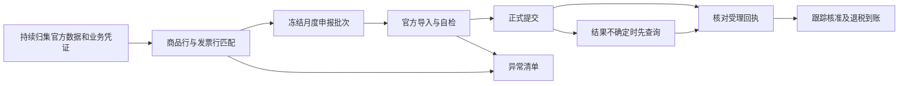

# 出口退税自动化方案

目标：常规业务自动完成资料归集、匹配、申报准备、线上自检、正式申报、回执跟踪和到账核对；平台强制身份验证及业务异常交给指定人员处理。

当前状态：已完成代码调查、上海官方流程调研及公开登录页面检查；第一轮相关测试通过。尚未实现月度自动任务，未登录企业税务账户，未提交真实申报。下述实施顺序是方案，不代表功能已上线。

## 适用范围与待确认信息

用户已确认申报主体为上海捷淞国际物流有限公司，企业性质为外贸公司，使用上海退税平台。按外贸企业免退税流程继续设计；一般贸易货物作为首批验证范围，实际备案办法、业务类型及管理类别仍须以企业账户为准。历史业务需按其适用政策分别判断。

首轮联调还需要确认：具体平台网址及主管税务机关、企业管理类别、经办人及登录验证方式、内部截止日、目前资料来源。另需在财务受控环境中取得一批已受理业务的官方明细表、回执和对应凭证，作为对照；真实凭证不进入本文件或 Git。

“月初之前”先作为内部备齐材料的目标。报关出口当月的货物通常从次月起申报，因此月底准备和次月正式提交需要分开安排；以前月份已具备条件的业务另行处理。实际运行日期以当地当期申报窗口为准，不写死每月 1—15 日。

## 已核对的政策与官方能力

- 常规报关出口货物的申报窗口为出口次月起至次年 4 月 30 日前的各增值税纳税申报期；补充申报涉及 36 个月限制及收汇材料。免退税的一般外贸货物计税依据取匹配购进凭证金额，不能使用出口销售额。[财政部、税务总局公告 2026 年第 11 号，第四条和第九条](https://fgk.chinatax.gov.cn/zcfgk/c102416/c5247437/content.html)
- 官方提供电子税务局、标准版国际贸易“单一窗口”和离线申报工具。申报后还需整理备案目录，通常为申报后 15 日内、留存 10 年；一般业务不应一律强制等全部收汇后才能准备申报，需区分收汇期限与申报时报送材料的情形。[国家税务总局公告 2026 年第 5 号，第 41—49 条](https://fgk.chinatax.gov.cn/zcfgk/c100012/c5247423/content.html)
- 上海官方材料已介绍报关单、进货发票在线集成和智能配单；2025 年材料继续介绍单一窗口“智能问诊”自检疑点处理功能，应优先复用。[上海出口退税服务材料](https://shanghai.chinatax.gov.cn/zzzb/zxfb/202304/P020230406591273919749.pdf)、[2025 年上海税务服务材料](https://shanghai.chinatax.gov.cn/sjtax/ztzl/yshj/ldjj/202508/P020250801323902960538.pdf)。材料证明功能存在，企业当前可用菜单与模板仍需登录复核。

政策依据能证明网上申报渠道存在，不能证明企业可获得直接申报 API，也不能证明账号支持无人值守登录。

## 上海实际落地路线

建议沿用财务当前申报渠道：若使用上海本地单一窗口，优先接其“出口退税在线申报”；若使用上海电子税务局，则接“免退税申报”。只实现实际使用的一条申报路径，另一条保留作人工备选，避免同批数据跨渠道重复提交。

### 公开入口与实查结果

| 入口或资料 | 已验证内容 | 对实施的影响 |
| --- | --- | --- |
| [上海单一窗口当前首页](https://www.singlewindow.sh.cn/winx-portal/#/home) | 浏览器实际打开成功；有中央标准应用、地方特色应用及登录入口 | 上海本地版与全国标准版是不同入口，不能按通用全国版教程直接编写操作脚本 |
| [上海本地登录](https://www.singlewindow.sh.cn/winx-portal/#/login?service=%2Fhome) | 实见用户名/手机号、密码，另有短信验证码登录；本轮未输入凭据 | 密码登录可能适合自动化，但不能据此认定登录后、风险验证或正式提交不需要额外认证 |
| [全国标准版登录入口](https://www.singlewindow.cn/) | 从上海入口切换“标准版账号/卡介质登录”后，实见账号登录、卡介质登录和图形验证码 | 与上海本地登录分别验证，不能把一边的认证条件推定到另一边 |
| [上海一网通办官方指南](https://zwdt.sh.gov.cn/govPortals/bsfw/item/b4100cc2-3d52-40c1-802e-04743fd033f3) | 指南介绍退税账号登录、企业海关编码确认和上海本地登录；技术支持 400-821-2199 | 首次联调确认账号对应企业、海关编码和退税功能是否已开通；不新注册重复账号 |
| [上海电子税务局](https://etax.shanghai.chinatax.gov.cn/) | 上海公开手册给出“我要办税 → 出口退税管理 → 出口退免税申报 → 免退税申报”路径；本轮该站公开页面访问不稳定 | 以企业实际登录后菜单为准，不能把“免抵退税”或“一般退税管理”当作普通外贸免退税入口 |
| [2026 年认证等级说明](https://shanghai.chinatax.gov.cn/jstax/ztzl/yshj/sycz/202603/t479707.html) | 说明涉及数电票功能二次认证、跨省身份切换和 APP 密码加短信登录 | 这些规则不是“所有退税提交每次必刷脸”的证据，具体动作分别测试 |
| [上海税率文库下载中心](https://shanghai.chinatax.gov.cn/bsfw/xzzx/rjxz/index.html) | 列有 2026B 版，公布日期为 2026-06-10 | 首次联调检查系统使用版本；后续按最新文库及业务适用日期取税率，不能只取数据库最新一行 |

公开访问中，旧地址 `https://sh.singlewindow.cn/winxportal/index_sh.jsp` 出现证书域名错误；没有绕过验证。改从官方指南列明的 `https://www.singlewindow.sh.cn/` 正常进入新版首页。因此实施时以新版入口及财务当前书签核对结果为准，不能固化旧链接。

上海公开操作手册路径参考：[出口退税热点问题手册](https://shanghai.chinatax.gov.cn/zcfw/zcjd/202409/W020240923603666367887.pdf)、[上海单一窗口申报操作手册](https://www.singlewindow.sh.cn/epcms-api/file/41a62ed6-309a-4594-bb51-b8e0d0b1e3ba.pdf)。这两份材料早于 2026 年新规，本轮部分 PDF 原站读取失败，公开检索能返回相关操作段落；不将其中旧字段、控件或截图当作当前导入契约。

### 两个线上环节分别接通

1. **税务数字账户：查票及用途。** 读取官方发票明细和用途状态，与本次进货凭证分配对应；已经用于抵扣、已红冲或用途不明的凭证进入异常处理。系统台账里的“正常”和“正数”不能替代官方用途状态。上海官方明确可以在“全量发票查询”查看用途标签；错误退税用途的回退需要申请处理，不能由程序无依据改动。[上海 2026 年发票勾选问答](https://shanghai.chinatax.gov.cn/zcfw/rdwd/202601/t479079.html)
2. **退税申报平台：取数、配单、自检、提交、回执。** 优先利用平台已有报关单和发票取数，不先走加密 XML 下载解密路径；对平台不能直接取得的信息，再核对现行文件导入格式。平台配单建议与内部匹配结果交叉检查后形成最终批次。自检结果留在该批次，结果不确定时查询受理状态再决定后续动作。

未取得公开的、可供本企业直接申请使用的出口退税申报 API 接入契约。首版按官方现有功能加网页操作设计；如平台技术支持能提供正式授权接口，再评估替换网页操作。公开调研结果不能证明接口不存在，也不采用未公开内部请求作为稳定契约。

### 官方字段与内部数据对齐

| 官方业务字段 | 当前内部来源 | 必须核对或补齐 |
| --- | --- | --- |
| 申报主体、年月及批次 | 企业配置及 `TaxRefund` 记录 | 取实际备案主体；补月度批次，正式申报时间取回执 |
| 进货和出口两表的关联号 | 当前 `relation_no` 用于查找采购合同 | 采购合同关联标识与官方申报关联号分别处理；按平台现行规则生成，确保双表关联一致 |
| 报关单商品行、数量、单位、出口日期、离岸价 | `CustomsDeclaration` 与 `CustomsDeclarationItem` | 核对正式海关数据、法定单位、运保费及币种；不能只输出内部报关单 ID |
| 进货凭证号、销方税号、开票日期、计税金额、征税率 | `InvoiceRecord` 与采购链路 | 使用正式票面字段和本次分配份额，保留号码前导零；不以采购合同预计值代替 |
| 申报商品代码、退税率、业务类型 | HS 税率证据及实际出口业务 | 按有效文库和现行规则映射，不能直接复制征税率或假定业务类型 |
| 官方回执及办理结果 | 现有退税状态、历史证据导入能力 | 按主体、期间、批次核对金额和状态；核准与到账分别确认 |

`backend/scripts/import-tax-refund-evidence.js` 已有出口明细、进货明细及受理通知书交叉校验，首批对照可复用其解析思路。但它当前要求关联号在两表各唯一且行数相同；正式平台出现一对多配单时，需要按官方规则汇总校验，不能把这个历史导入限制扩散到自动申报。

首版最少交付三件事：在现有工作台生成完整月度候选及异常清单；依据实际平台数据模式完成配单核对或官方模板导入；完成一批实际自检与申报回执核对。若存在必须由本人完成的认证，任务保存批次并在验证后续跑；没有完成企业账户验证前，不宣称“纯无人值守”已可用。

### 月初目标与当前申报日历

内部目标仍是月底备齐资料，次月窗口开放后尽早申报。上海官方 2026 年 10 月办税日历显示当期申报纳税期限顺延至 10 月 26 日；这不是“每月月初前必须提交”的依据，也不能自动推定所有出口退税事项均在该日截止。正式运行按企业具体事项窗口核对。[上海 10 月申报期限通知](https://shanghai.chinatax.gov.cn/tax/hptax/tzgg/sstz/202609/t481634.html)

如需向平台技术支持核实，准备的问题是：上海本地出口退税是否支持现行数据导入或授权接口；是否可直接取报关单及已确认退税用途的发票；登录和正式提交分别要求什么验证；现行 2026 年模板及客户端有哪些环境要求；受理回执如何查询和导出。本轮未联系外部人员。

## 现有实现与缺口

| 环节 | 已有实现 | 自动提交前需要补齐 |
| --- | --- | --- |
| 资料准备 | `backend/src/services/taxRefundPreparationService.js` 汇总凭证、备案资料和期限 | 区分申报阻塞、备案后续事项、收汇到期事项，确定资料来源与更新频率 |
| 工作台与核验 | `backend/src/services/taxRefundWorkbenchService.js` 聚合合同、报关单、采购发票台账；`invoiceVerificationService.js` 比较销方、金额、品名和正常/正数状态 | 台账一致性不等于税局用途确认、电子信息一致性或最终受理；按实际出口商品行与发票行分配数量和金额 |
| 税务测算 | `backend/src/services/taxCalculationEngine.js` 已采用采购专票口径的预计值 | 保留估算用途；正式申报取真实凭证及对应分配金额，避免以采购成本推算值直接申报 |
| 自动草稿 | `backend/src/services/taxRefundDraftService.js` 按报关商品金额乘 HS 退税率生成草稿 | 与采购凭证口径统一；征税率不得替代缺失退税率；取业务适用日期的有效税率；缺少部分税率不得生成可提交的部分金额 |
| 导出 | `backend/src/services/taxRefundExportService.js` 校验采购合同关联号、发票号及征税率，输出内部 CSV | 目前列名含内部 ID，不能宣称是官方导入文件；需从目标平台下载现行模板并实测进货明细及出口明细的导入、自检 |
| 批次与状态 | `backend/prisma/schema.prisma` 的 `TaxRefund` 有草稿、申请、核准、退税等状态 | 缺少月度批次、线上受理回执和提交结果不确定的恢复依据；草稿 `appliedAt` 不能充当实际申报时间 |
| 线上操作 | 当前工作台明确由财务完成登录、用途确认和正式提交 | 验证现有官方自动功能及授权接口；不足部分再针对实际网页做自动操作 |

另外，自动批次不能直接复用当前页面的候选范围：页面仅加载前 100 条，后端工作台按合同展示最新报关单与最新退税记录。月度任务必须完整枚举未申报的合格业务行，包含以前月份遗漏记录，避免合同多报关单、多批次及分页导致漏报。

## 目标流程



1. **持续归集。** 采购发票、报关单和合同进入现有数据链路；优先采用官方可下载的结构化数据和现有导入能力。OCR 只辅助取字段，AI 不自行确定税率、用途、计税金额或缺失证据。自动下载能否实现取决于登录条件；仅能手工导入时明确标记该人工环节。
2. **匹配与计算。** 在出口商品行和进货凭证行之间分配本次申报数量、金额，核对商品名称、单位、税率及有效日期。合法拆分的发票保留已使用和剩余份额，不能整张重复计入不同批次；无法确定的关系进入异常清单。
3. **形成批次。** 按主体、申报年月和批次管理，冻结明细与税率依据，列出可申报、缺件、待信息同步和需特殊处理的业务。业务数据变化后重新核验；不覆盖或删除已提交记录。现有 `replaceExisting` 删除路径必须先限制到允许重建的草稿。
4. **官方自检。** 上传平台接受的真实格式，核对平台解析出的条数、数量和金额，再取得自检结果。税局缺少报关单或发票电子信息时等待同步或进入查询处理；自检通过不等于税局核准。
5. **正式提交。** 首批由财务按同一业务逐项对照验证。完成验收并具备有效办税授权后，常规批次可按约定自动提交；只有平台强制身份验证或不满足条件的业务才转人工。具体是否需要扫码、短信、刷脸或硬件证书，以实际账户测试为准。
6. **回执及到账。** 提交后记录官方受理标识及真实状态；网络超时先查是否已受理，禁止盲目重提。核准结果与银行实际入账分别核对，不能用预计额或手工状态认定到账。备案目录和收汇跟踪继续使用同一工作台。

内部批次与提交状态暂定为：待资料 → 待自检 → 待提交 → 提交结果待核实 / 已受理 → 已核准 / 待补正 → 已到账。最终字段设计以首批真实流程为依据，不先增加通用工作流引擎。

## 每月运行安排

以下为建议节奏，不是已创建的定时任务。以北京时间、公司内部截止日和当期官方窗口共同安排。

| 时间 | 自动动作 | 交付结果 |
| --- | --- | --- |
| 平时 | 增量归集、逐行核验、收汇和缺件跟踪 | 数据及时更新，异常能提前发现 |
| 月底前一周 | 扫描全部待申报业务及历史遗漏 | 缺件清单，明确缺什么、由谁补、何时必须处理 |
| 月底前两个工作日 | 复核候选明细、数量份额、金额和有效税率 | 预备批次；月底新增或变更数据继续纳入复核 |
| 月底 | 汇总资料、完成内部检查 | 尽量在月初前达到可提交状态，未齐业务保留原因 |
| 次月实际窗口开放后 | 刷新官方电子信息、用途状态，导入、自检和提交 | 官方受理结果或需处理事项 |
| 受理后 | 跟踪补正、核准、入账、备案及收汇到期 | 全流程状态有依据，异常可恢复 |

不假设缺件业务必须等下一月：资料齐套后，在官方允许的窗口重新评估并追加批次。只在有新的缺件、失败、待身份验证、截止风险或办理结果时通知；是否使用外部消息渠道另按用户授权。

## 最短实施顺序与验收

### 先补每次出货的准备清单

用户确认希望在每次出货时整理凭据，月初直接汇总。实施优先级因此前移到日常备料，而不是先开发线上提交机器人。

当前系统已有两个可复用入口：出口详情的“出口三单工作台”生成并归档外销合同、商业发票和装箱单；“检查退税材料”实时读取当前专项单资料，能导出准备清单、关联发票和规则口径三张 Excel 表。这两项无需重建。

出口三单中的商业发票用于对外销售，供应商进项专票用于购进凭证，必须分开管理；出口三单齐套不能直接认定退税可申报。[2026 年管理办法第十八条](https://shanghai.chinatax.gov.cn/zzzb/zcwj/202602/t479288.html)

| 优先补齐 | 当前缺口 | 最小验收结果 |
| --- | --- | --- |
| 每次出货对应一份资料清单 | 已有合同级查询，但确认发运没有形成明确的出货资料整理动作；退税工作台只展示合同最新报关单/记录 | 从每次出货进入对应清单；同合同多次出货、多报关单分别列出，不漏旧业务 |
| 明确出货资料版本与凭证类型 | 三单归档为一个工作簿，但准备清单未明确关联该版本；购销合同项仅核对采购附件；运输项把船司装箱单核对文件也当作运输凭证 | 关联本次外销合同、商业发票、装箱单版本；签署件与系统生成件分别标记；提单/运单与装箱单分别核验，缺提单不能因装箱单已上传而显示运输凭证已齐 |
| 补件及时更新与逐行匹配 | 现有清单查询时刷新，但缺少统一的逐次出货补件进度；票号登记、票面核验与税局用途状态未全部接通 | 发运后继续补报关单、进项专票、运输单据等；清单读取最新关联事实，指出具体缺件；商品、数量、单位、税额及发票可用份额有可追溯依据 |
| 次月汇总待申报业务 | 当前工作台没有完整的月度出货汇总入口，不能直接拿前 100 条或合同最新记录组批 | 一次汇总未申报的齐套业务及历史补齐业务，缺件业务列明原因；内部汇总金额与后续官方配单结果核对一致 |

建议的逐次出货清单列为：出口专项单/本次出货标识、发运与出口日期、三单版本、报关单及商品行、关联采购合同、进项发票及本次使用份额、提单/运单、材料缺口、内部准备状态、申报年月/批次、官方受理及到账状态。复用现有来源，不再让使用者重复填写系统已有字段。

时序：制单时确认三单版本 → 发运时进入资料准备 → 报关及供应商开票后补齐并核验 → 月底复查缺件 → 次月实际窗口内组批、自检、申报。出货当天缺报关或供应商专票可以先处于“待补件”，不把材料未齐错误标记为申报完成。准备清单的齐套、官方自检通过和税局受理是三个不同状态。

本轮完成上述现有链路与缺口核对，尚未修改发运、附件或月度汇总业务代码；此前的代码调查和测试不构成这些新增行为已上线的证据。

| 顺序 | 具体交付 | 验收条件 |
| --- | --- | --- |
| 1. 跑通一批现有流程 | 在财务受控环境中对照已成功申报的一批业务，核实平台、模板、用途确认、登录及回执 | 内部来源能对应官方每一行，明确剩余人工动作；不重新提交历史业务 |
| 2. 修正共享计算与申报门槛 | 复用采购金额、税率和现有准备逻辑；补正式凭证分配，统一草稿及导出校验 | 相同凭证与财务官方结果一致；缺税率、重复份额、错误用途、无有效电子信息的业务不能提交；已提交记录不被删除 |
| 3. 生成完整月度批次 | 在既有退税工作台补批次、异常原因和官方格式导出 | 超过 100 条、合同多报关单、发票拆分和跨月补报均不漏不重；官方平台导入、自检通过 |
| 4. 接通线上操作 | 先使用官方现有自动能力，确需补齐时只为已选平台增加一个操作 Adapter | 能正确定位企业和期间；身份验证后可续跑；超时可查回执；恢复不重复提交 |
| 5. 启用月度运行 | 定时准备、符合条件时提交、回执和到账跟踪 | 首批实际受理并核对金额；用重复运行、网络超时及失败恢复场景证明不会多报；再启用常规无人值守 |

复用现有工作台、申报准备、发票核验、金额与税率 Module，不新增并列退税页面，不更换 AI 模型或部署配置。生产企业、海外仓预退税、代理出口及其他特殊业务，在确认实际需要后补相应流程，不能默认混入普通外贸批次。

数据与凭证继续遵循根目录 `AGENTS.md`、`SECURITY.md` 和 `data-classification.json`：真实税务证据只在授权财务环境中操作，不存 Git、普通附件或日志；合同及文档通过现有 `fileService.js` 受控存储，银行原件遵循银行资料的专门限制。此方案未改变现有权限或安全配置。

## 本轮验证与下一步

代码调查覆盖工作台、HTTP 路由、草稿、导出、准备清单、发票核验、税务测算及 Prisma 相关模型。现有 6 个测试文件共 27 项通过；这些测试验证当前实现，部分草稿测试仍表达现有估算行为，不能当作正式税务计算已正确的证据。

复现命令，在 `backend/` 执行：

```sh
npm test -- src/services/taxRefundWorkbenchService.test.js src/services/taxRefundPreparationService.test.js src/services/taxRefundDraftService.test.js src/services/taxRefundExportService.test.js src/services/taxCalculationEngine.test.js src/controllers/taxRefundController.test.js
```

本轮上海专项只更新调研和方案，没有修改业务代码，因此未重复运行第一轮 27 项测试。公开首页与本地登录界面已实际检查；企业内页、当前导入模板、账号认证、用途确认、正式提交及回执仍未验证。

下一步：确认财务实际平台网址及登录/提交验证方式，在受控环境中用一批已受理业务和最新官方模板完成第 1 步；随后修正共享计算、关联号映射和导出门槛。缺少企业内页验证时，不能认定正式自动申报已可运行。
